# NexTest Pro - 业务文档

> 企业级测试管理与自动化平台完整业务文档

**文档版本**: v1.0  
**最后更新**: 2025-11-22  
**系统版本**: 0.0.0

---

## 📋 目录

### 1. [系统概述](#1-系统概述)
- 1.1 产品定位
- 1.2 核心价值
- 1.3 技术架构
- 1.4 系统特性

### 2. [架构设计](#2-架构设计)
- 2.1 系统架构图
- 2.2 技术栈
- 2.3 模块划分
- 2.4 数据流向

### 3. [数据模型](#3-数据模型)
- 3.1 核心实体关系图
- 3.2 实体详细说明
- 3.3 数据库Schema
- 3.4 枚举类型定义

### 4. [功能模块](#4-功能模块)
- 4.1 仪表盘 (Dashboard)
- 4.2 测试用例库 (Test Repository)
- 4.3 自动化实验室 (Automation Lab)
- 4.4 动作库 (Action Library)
- 4.5 数据模型 (Data Schema)
- 4.6 执行历史 (Execution History)
- 4.7 文档中心 (Documentation Hub)
- 4.8 管理后台 (Admin Portal)
- 4.9 系统配置 (System Config)

### 5. [业务流程](#5-业务流程)
- 5.1 用户登录流程
- 5.2 测试用例创建流程
- 5.3 工作流编排流程
- 5.4 测试执行流程
- 5.5 权限验证流程

### 6. [权限系统](#6-权限系统)
- 6.1 RBAC模型
- 6.2 权限列表
- 6.3 角色定义
- 6.4 多租户架构

### 7. [API接口](#7-api接口)
- 7.1 接口设计原则
- 7.2 核心接口列表
- 7.3 数据交互格式

### 8. [工作流引擎](#8-工作流引擎)
- 8.1 节点类型
- 8.2 执行逻辑
- 8.3 变量系统
- 8.4 错误处理

### 9. [AI集成](#9-ai集成)
- 9.1 Gemini服务
- 9.2 AI功能列表
- 9.3 使用场景

### 10. [部署运维](#10-部署运维)
- 10.1 环境要求
- 10.2 部署流程
- 10.3 配置说明

---


## 1. 系统概述

### 1.1 产品定位

**NexTest Pro** 是一个现代化的企业级测试管理与自动化平台，融合了测试用例管理、可视化工作流编排、脚本库管理和AI辅助功能。

**目标用户**:
- QA测试工程师
- 自动化测试开发
- 测试经理/项目经理
- DevOps工程师

### 1.2 核心价值

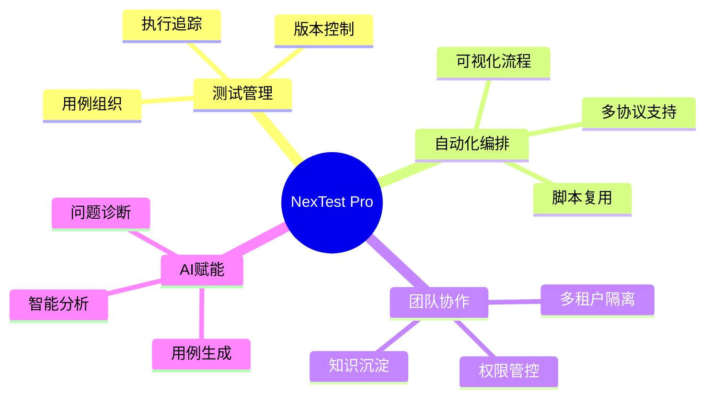

### 1.3 技术架构

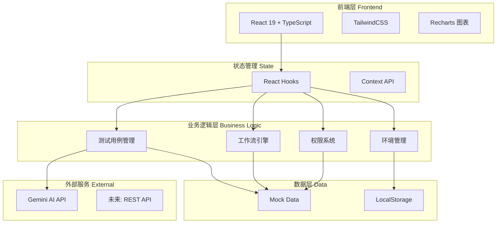

### 1.4 系统特性

| 特性分类 | 功能点 | 说明 |
|---------|--------|------|
| **测试管理** | 树形用例组织 | 支持文件夹层级结构 |
| | 步骤级编排 | 每个步骤可绑定脚本、条件、循环 |
| | 变量系统 | 支持环境变量、用例变量、输出映射 |
| **自动化** | 可视化工作流 | 类似 n8n 的拖拽式编排 |
| | 多节点类型 | HTTP/DB/Redis/Kafka/Browser/AI等 |
| | 子流程调用 | 工作流可嵌套复用 |
| **权限** | RBAC模型 | 基于角色的访问控制 |
| | 多租户 | Organization -> Project 隔离 |
| | 细粒度权限 | 菜单级 + 操作级权限 |
| **AI能力** | 用例生成 | 根据需求描述自动生成测试用例 |
| | 报告分析 | 智能分析执行结果并给出建议 |
| | 智能问答 | 基于日志的问题诊断 |

---


## 2. 架构设计

### 2.1 系统架构图

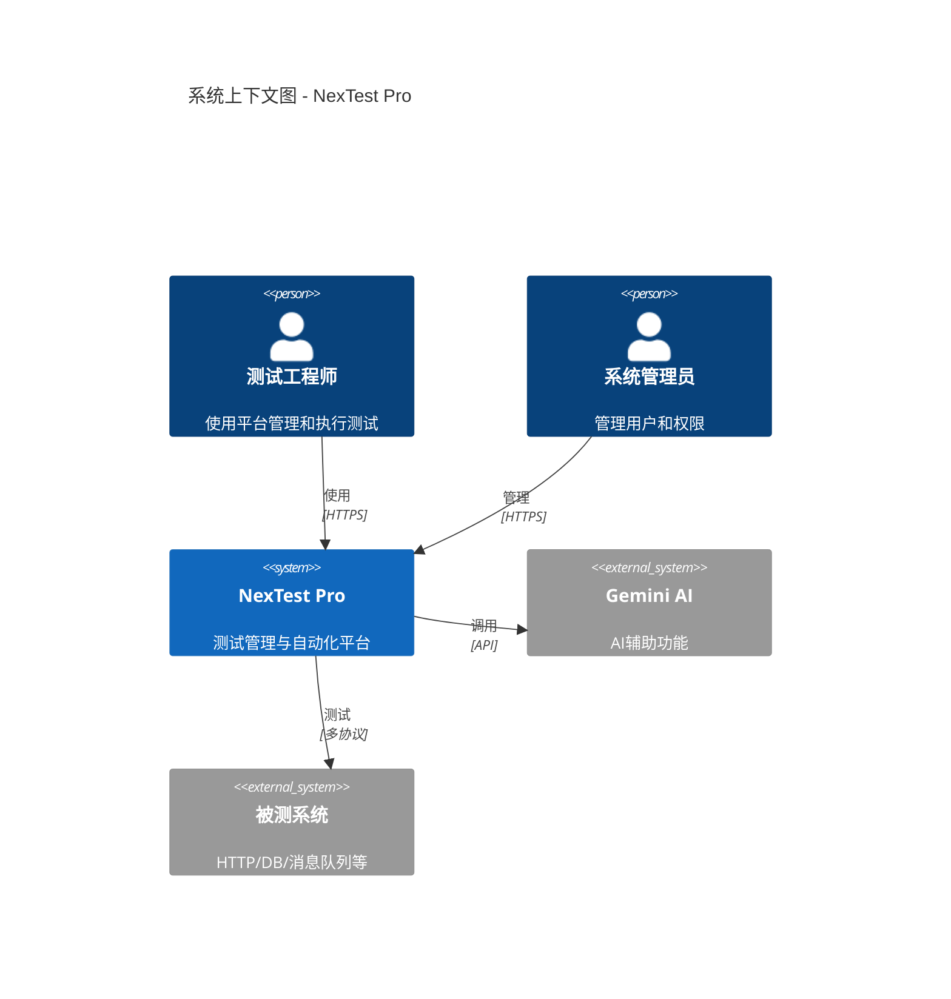

### 2.2 技术栈

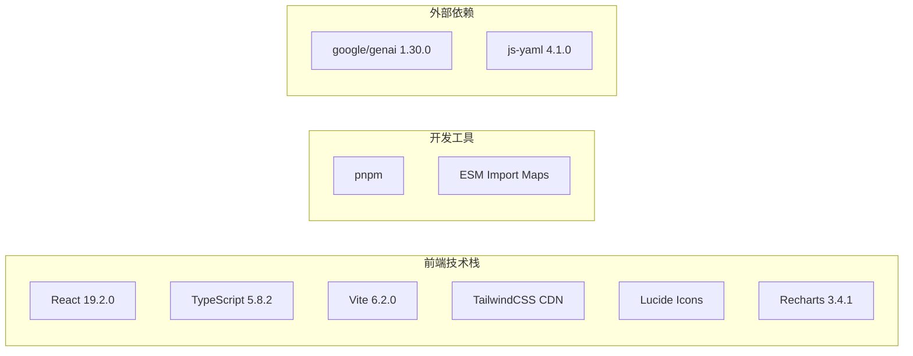

**技术选型说明**:

| 技术 | 版本 | 选型理由 |
|------|------|----------|
| React | 19.2.0 | 最新版本，性能优化，并发特性 |
| TypeScript | 5.8.2 | 类型安全，提升代码质量 |
| Vite | 6.2.0 | 快速开发服务器，HMR |
| TailwindCSS | CDN | 快速原型开发，无需构建配置 |
| Recharts | 3.4.1 | React原生图表库，易于集成 |
| Gemini AI | 1.30.0 | Google AI服务，支持结构化输出 |

### 2.3 模块划分

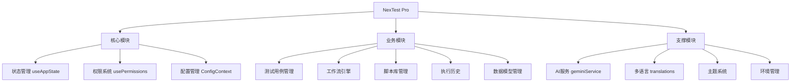

### 2.4 数据流向

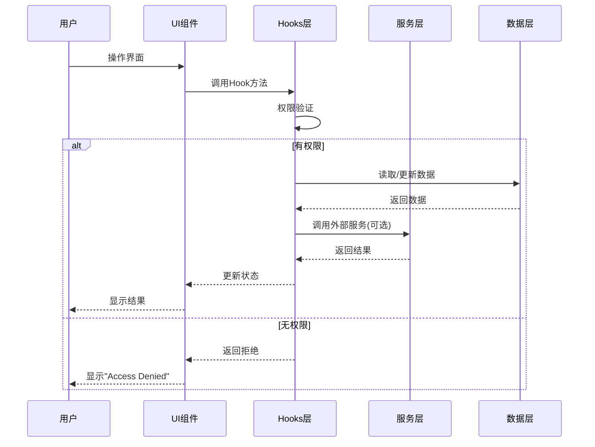

**数据流说明**:

1. **单向数据流**: 遵循 React 单向数据流原则
2. **状态提升**: 全局状态通过 `useAppState` 管理
3. **权限拦截**: 所有操作前进行权限验证
4. **多租户过滤**: 数据按 `projectId` 自动过滤

---


## 3. 数据模型

### 3.1 核心实体关系图

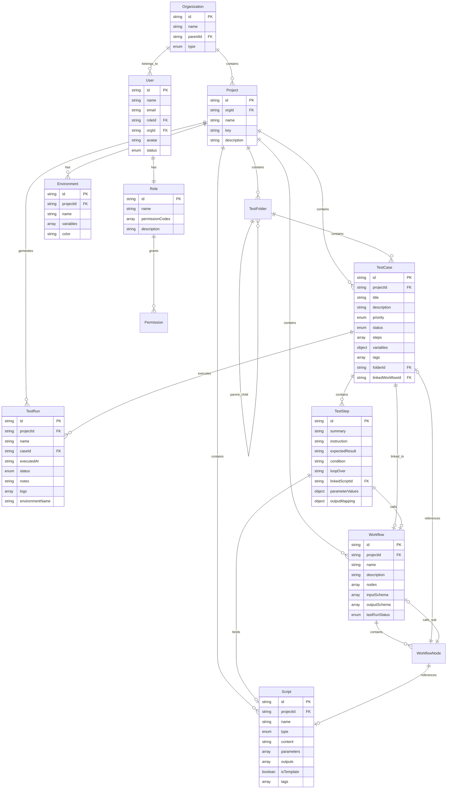

### 3.2 实体详细说明

#### 3.2.1 多租户实体

**Organization (组织)**
```typescript
interface Organization {
  id: string;              // 唯一标识
  name: string;            // 组织名称，如 "Acme Corp Global"
  parentId?: string;       // 父组织ID，支持层级结构
  type: 'department' | 'team';  // 组织类型
}
```

**Project (项目)**
```typescript
interface Project {
  id: string;              // 唯一标识
  orgId: string;           // 所属组织
  name: string;            // 项目名称，如 "E-Commerce Core"
  key: string;             // 项目简称，如 "ECC"
  description?: string;    // 项目描述
}
```

**数据隔离规则**:
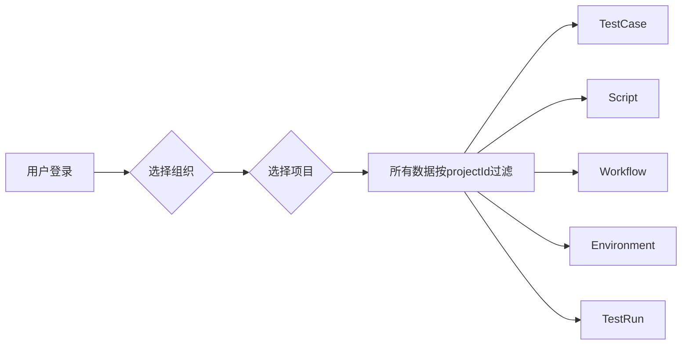

#### 3.2.2 权限实体

**User (用户)**
```typescript
interface User {
  id: string;
  name: string;
  email: string;
  roleId: string;          // 关联角色
  orgId: string;           // 所属组织
  avatar?: string;         // 头像URL
  status: 'active' | 'inactive';
}
```

**Role (角色)**
```typescript
interface Role {
  id: string;
  name: string;            // 如 "Administrator", "Editor", "Viewer"
  permissionCodes: string[]; // 权限代码列表
  description?: string;
}
```

**Permission (权限)**
```typescript
interface Permission {
  code: string;            // 如 "VIEW_DASHBOARD", "CREATE_CASE"
  name: string;            // 显示名称
  category: 'Menu' | 'Action' | 'System';
  description: string;
}
```

#### 3.2.3 测试实体

**TestCase (测试用例)**
```typescript
interface TestCase {
  id: string;
  projectId: string;       // 多租户隔离
  title: string;
  description: string;
  priority: Priority;      // LOW | MEDIUM | HIGH | CRITICAL
  status: Status;          // DRAFT | ACTIVE | DEPRECATED
  steps: TestStep[];       // 测试步骤
  variables?: Record<string, string>;  // 用例级变量
  preconditions?: string[];            // 前置条件
  testData?: TestData[];               // 测试数据
  tags: string[];
  folderId: string;
  lastUpdated: string;
  automationType?: 'MANUAL' | 'WORKFLOW';
  linkedWorkflowId?: string;  // 关联的自动化工作流
}
```

**TestStep (测试步骤)**
```typescript
interface TestStep {
  id: string;
  summary?: string;        // 步骤标题
  instruction: string;     // 详细说明，支持变量 {{var}}
  expectedResult: string;  // 预期结果
  
  // 控制流
  condition?: string;      // 条件执行，如 "{{user}} != null"
  loopOver?: string;       // 循环变量，如 "{{userList}}"
  loopVar?: string;        // 迭代器变量名
  
  // 自动化绑定
  linkedScriptId?: string;           // 绑定的脚本ID
  parameterValues?: Record<string, string>;  // 参数映射
  outputMapping?: Record<string, string>;    // 输出映射
  linkedWorkflowId?: string;         // 调用子工作流
}
```

#### 3.2.4 自动化实体

**Script (脚本)**
```typescript
interface Script {
  id: string;
  projectId: string;
  name: string;
  description?: string;
  type: ScriptType;        // PYTHON | JAVASCRIPT | SHELL | TEMPLATE
  content: string;         // 脚本代码
  parameters: ScriptParameter[];  // 输入参数定义
  outputs?: ScriptParameter[];    // 输出参数定义
  testExamples?: TestExample[];   // 测试示例
  isTemplate: boolean;     // 是否为模板
  tags: string[];
  lastModified: string;
}
```

**Workflow (工作流)**
```typescript
interface Workflow {
  id: string;
  projectId: string;
  name: string;
  description: string;
  nodes: WorkflowNode[];   // 节点列表
  inputSchema?: ScriptParameter[];   // 全局输入
  outputSchema?: ScriptParameter[];  // 全局输出
  lastRunStatus?: ExecutionStatus;
  lastRunAt?: string;
}
```

**WorkflowNode (工作流节点)**
```typescript
interface WorkflowNode {
  id: string;
  type: NodeType;          // 节点类型，见下文
  name: string;
  referenceId?: string;    // 引用的资源ID
  stepId?: string;         // 引用的步骤ID
  config?: NodeConfig;     // 节点配置
  children?: WorkflowNode[];      // 子节点（循环/条件）
  elseChildren?: WorkflowNode[];  // Else分支
}
```

### 3.3 数据库Schema

**users 表**
```sql
CREATE TABLE users (
    id INT PRIMARY KEY,
    username VARCHAR NOT NULL,
    email VARCHAR NOT NULL,
    created_at TIMESTAMP NOT NULL
);
```

**orders 表**
```sql
CREATE TABLE orders (
    id INT PRIMARY KEY,
    user_id INT,
    total DECIMAL,
    status VARCHAR,
    created_at TIMESTAMP
);
```

### 3.4 枚举类型定义

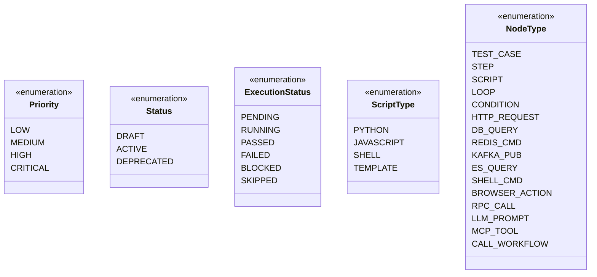

---


## 4. 功能模块

### 4.1 仪表盘 (Dashboard)

**功能概述**: 执行概览与实时指标展示

**页面布局**:
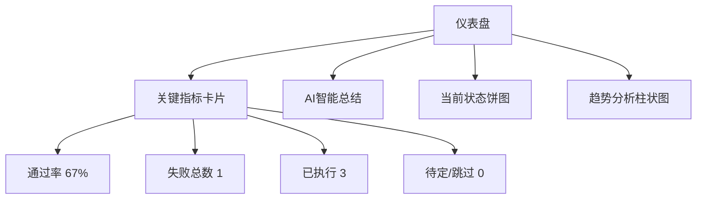

**数据来源**:
- 从 `TestRun[]` 数组统计当前项目的执行记录
- 按 `projectId` 过滤，只显示当前项目数据
- 实时计算通过率 = PASSED / (PASSED + FAILED)

**交互功能**:
1. **导出报告**: 点击右上角按钮导出PDF/Excel报告
2. **AI分析**: 调用 Gemini API 分析执行摘要，给出风险评估

**权限要求**: `VIEW_DASHBOARD`

---


### 4.2 测试用例库 (Test Repository)

**功能概述**: 树形结构的测试用例管理

**页面布局**:
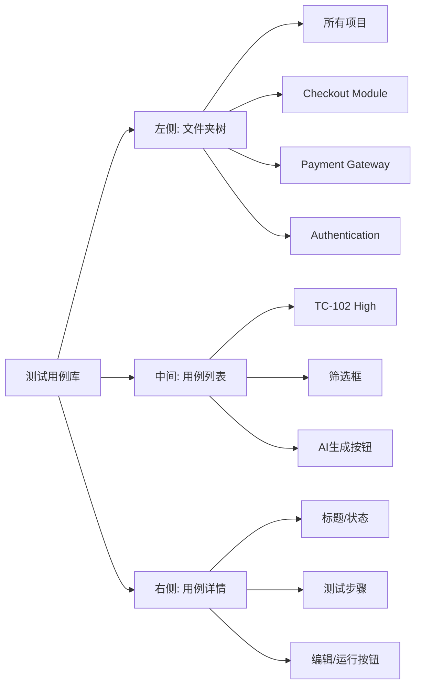

**核心功能**:

1. **文件夹管理**
   - 支持三层结构: Project -> Module -> Folder
   - 拖拽排序（未实现）
   - 新建文件夹

2. **用例管理**
   - 创建用例（手动/AI生成）
   - 编辑用例（标题、描述、优先级、步骤）
   - 删除用例
   - 筛选搜索

3. **步骤编排**
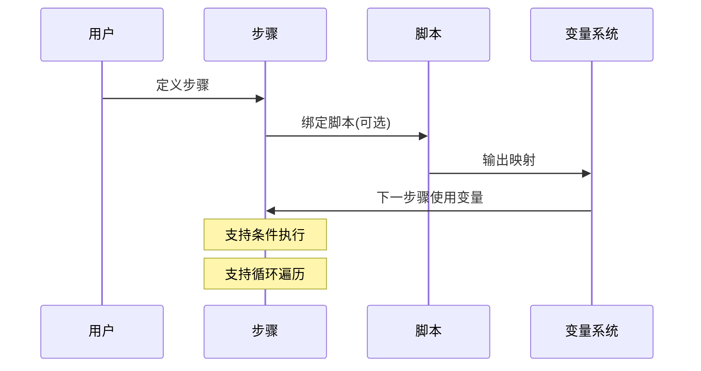

4. **变量系统**
   - 用例级变量: `variables: {testUser: 'admin_01'}`
   - 环境变量: 从 `activeEnv` 读取
   - 步骤输出: `outputMapping: {testUserId: 'currentUser'}`
   - 使用语法: `{{variableName}}`

**权限要求**: 
- 查看: `VIEW_CASES`
- 创建: `CREATE_CASE`
- 编辑: `EDIT_CASE`
- 删除: `DELETE_CASE`

---


### 4.3 自动化实验室 (Automation Lab)

**功能概述**: 可视化工作流编排器

**页面布局**:
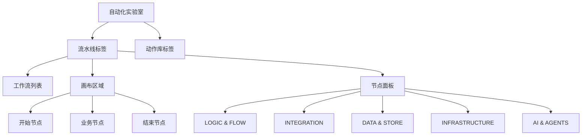

**工作流节点类型**:

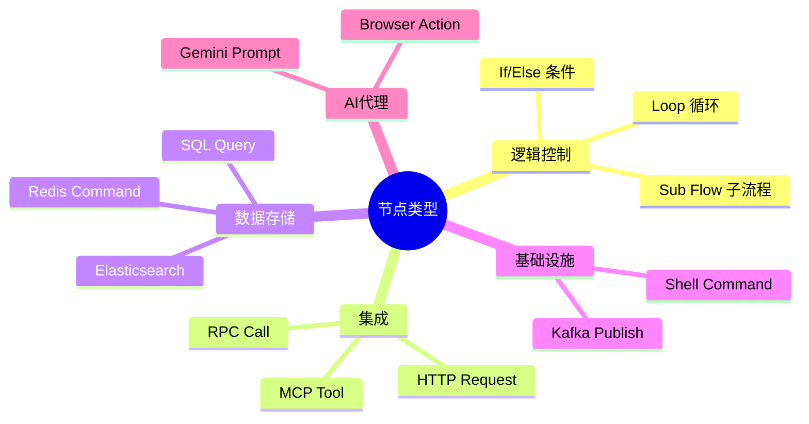

**工作流示例**:
```yaml
# Nightly Critical Path 工作流
name: Nightly Critical Path
nodes:
  - id: n1
    type: SCRIPT
    name: DataSetup.py
    
  - id: n2
    type: CONDITION
    name: Check Environment
    config:
      condition: "env.isReady == true"
    children:
      - type: STEP
        name: Navigate to login
      - type: STEP
        name: Click Login
    elseChildren:
      - type: SCRIPT
        name: SendAlert.py
        
  - id: n3
    type: LOOP
    name: Stress Test Cart
    config:
      loopCount: 5
    children:
      - type: TEST_CASE
        referenceId: TC-102
        
  - id: n4
    type: HTTP_REQUEST
    name: Sync to Jira
    config:
      method: POST
      url: "https://jira.api/v2/sync"
```

**编辑功能**:
1. 拖拽添加节点
2. 连线定义执行顺序
3. 配置节点参数
4. 水平/垂直布局切换
5. 可视化/YAML视图切换

**执行逻辑**:
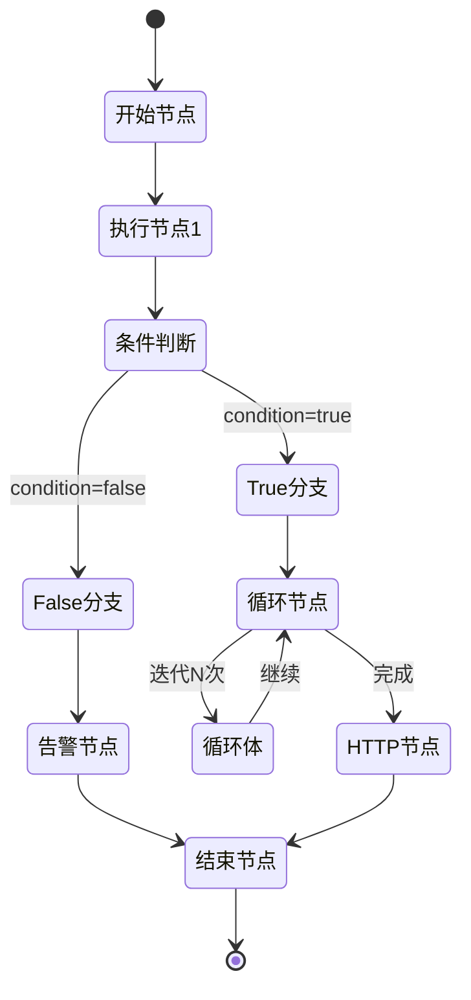

**权限要求**: `VIEW_AUTOMATION`, `MANAGE_SCRIPTS`

---


### 4.4 动作库 (Action Library)

**功能概述**: 脚本和模板管理中心

**三大分类**:

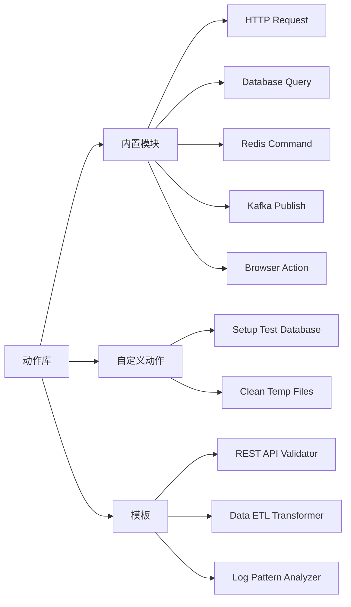

**内置模块列表**:

| 类别 | 模块名 | 说明 |
|------|--------|------|
| NETWORK | HTTP Request | 发送REST API请求 |
| DATA | Database Query | 执行SQL查询 |
| DATA | Redis Command | Redis缓存操作 |
| MESSAGING | Kafka Publish | 发布Kafka消息 |
| DATA | Elasticsearch | ES查询 |
| SYSTEM | Shell Command | 执行Shell命令 |
| UI | Browser Action | 浏览器自动化 |

**自定义动作结构**:
```typescript
{
  id: "sc-1",
  name: "Setup Test Database",
  type: "Python",
  parameters: [
    {
      name: "target_env",
      type: "string",
      description: "Environment (dev/staging)",
      defaultValue: "dev"
    }
  ],
  outputs: [
    {
      name: "userId",
      type: "string",
      description: "ID of the created test user"
    }
  ],
  testExamples: [
    {
      id: "te-1",
      name: "Dev Environment",
      inputValues: { target_env: "dev" }
    }
  ]
}
```

**脚本测试功能**:
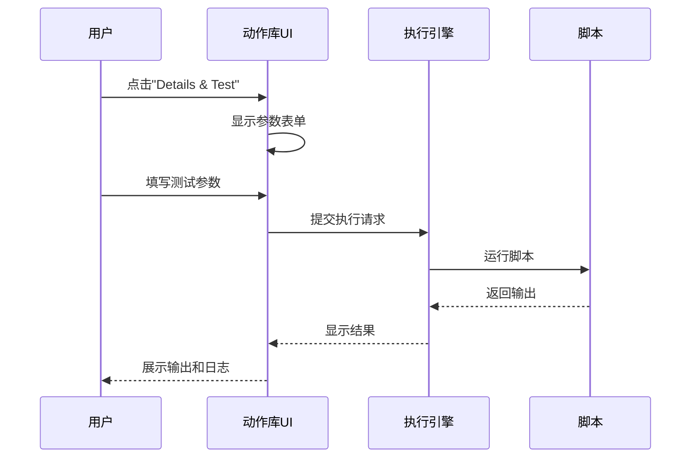

**模板使用流程**:
1. 浏览模板库
2. 选择合适的模板
3. 克隆为自定义动作
4. 修改参数和代码
5. 保存并测试
6. 在工作流中引用

**权限要求**: `VIEW_LIBRARY`, `MANAGE_SCRIPTS`

---


### 4.5 数据模型 (Data Schema)

**功能概述**: 数据库表结构管理

**页面布局**:
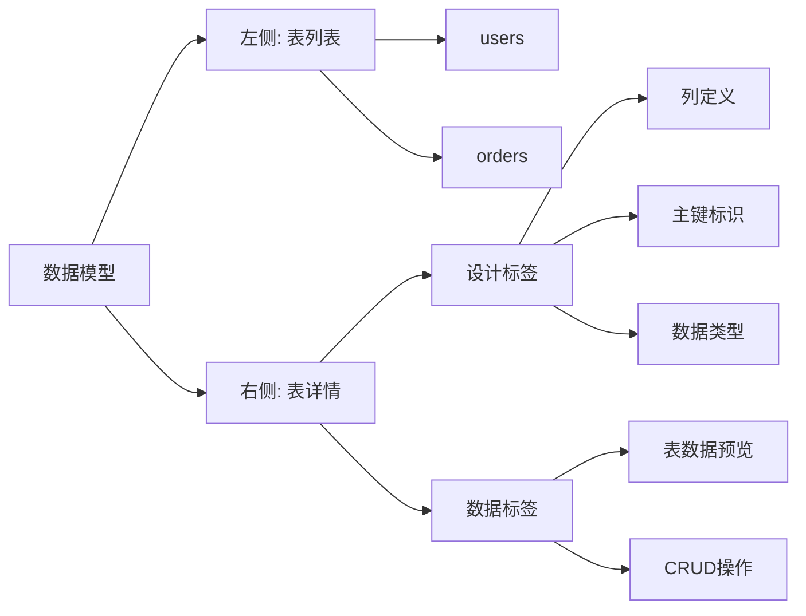

**表结构示例**:
```sql
-- users 表
CREATE TABLE users (
    id INT PRIMARY KEY,
    username VARCHAR NOT NULL,
    email VARCHAR NOT NULL,
    created_at TIMESTAMP NOT NULL
);

-- orders 表  
CREATE TABLE orders (
    id INT PRIMARY KEY,
    user_id INT REFERENCES users(id),
    total DECIMAL,
    status VARCHAR,
    created_at TIMESTAMP
);
```

**功能特性**:
- 可视化表结构设计
- 列的增删改
- 数据类型选择
- 主键/外键定义
- 表数据预览和编辑

**权限要求**: `VIEW_DATABASE`

---

### 4.6 执行历史 (Execution History)

**功能概述**: 测试运行记录查询

**页面布局**:
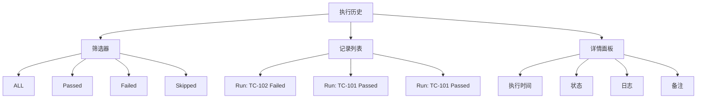

**记录结构**:
```typescript
interface TestRun {
  id: "r1",
  projectId: "proj-1",
  name: "Run: TC-101",
  caseId: "TC-101",
  executedAt: "2025-11-22T02:19:57Z",
  status: ExecutionStatus.PASSED,
  logs: [
    "> Step 1 Passed",
    "> Step 2 Passed"
  ],
  environmentName: "Staging",
  notes: "Calculation off by $1"
}
```

**状态统计**:
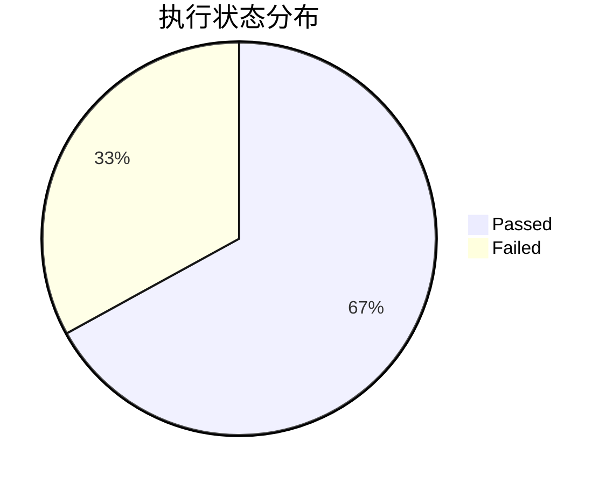

**权限要求**: `VIEW_HISTORY`

---

### 4.7 文档中心 (Documentation Hub)

**功能概述**: 项目知识库自动生成

**四大板块**:
```mermaid
graph TB
    A[文档中心] --> B[数据模型]
    A --> C[业务逻辑]
    A --> D[API接口]
    A --> E[工作流]
    
    B --> B1[系统实体列表]
    B --> B2[ER图]
    
    C --> C1[业务规则]
    C --> C2[流程图]
    
    D --> D1[接口列表]
    D --> D2[请求/响应示例]
    
    E --> E1[工作流列表]
    E --> E2[节点说明]
```

**自动生成内容**:
1. **数据模型**: 从 `types.ts` 提取实体定义
2. **业务逻辑**: 从测试用例提取业务规则
3. **API接口**: 从工作流HTTP节点提取
4. **工作流**: 展示所有工作流的可视化图

**权限要求**: `VIEW_DOCS`

---

### 4.8 管理后台 (Admin Portal)

**功能概述**: 用户、角色、组织、项目管理

**四大标签**:
```mermaid
graph LR
    A[管理后台] --> B[用户管理]
    A --> C[角色与权限]
    A --> D[组织架构]
    A --> E[Projects]
    
    B --> B1[用户列表]
    B --> B2[添加用户]
    B --> B3[编辑/停用]
    
    C --> C1[角色列表]
    C --> C2[权限矩阵]
    
    D --> D1[组织树]
    D --> D2[部门管理]
    
    E --> E1[项目列表]
    E --> E2[项目配置]
```

**用户管理**:
```typescript
// 用户列表示例
[
  {
    name: "Alice Admin",
    email: "alice@company.com",
    role: "Administrator",
    org: "Acme Corp Global",
    status: "活跃"
  },
  {
    name: "Bob Tester",
    email: "bob@company.com",
    role: "Editor",
    org: "Acme Corp Global",
    status: "活跃"
  }
]
```

**角色权限矩阵**:
| 角色 | 查看仪表盘 | 创建用例 | 管理用户 | 系统配置 |
|------|-----------|---------|---------|---------|
| Administrator | ✅ | ✅ | ✅ | ✅ |
| Editor | ✅ | ✅ | ❌ | ❌ |
| Viewer | ✅ | ❌ | ❌ | ❌ |

**权限要求**: `VIEW_ADMIN`, `MANAGE_USERS`, `MANAGE_PROJECTS`

---

### 4.9 系统配置 (System Config)

**功能概述**: 环境变量和系统设置

**配置项**:
```mermaid
graph TD
    A[系统配置] --> B[环境管理]
    A --> C[基本信息]
    A --> D[安全与访问]
    
    B --> B1[Development]
    B --> B2[Staging]
    B --> B3[Production]
    
    C --> C1[公司名称]
    C --> C2[主题颜色]
    
    D --> D1[SSO登录]
    D --> D2[公开注册]
```

**环境变量结构**:
```typescript
interface Environment {
  id: "env-1",
  projectId: "proj-1",
  name: "Development",
  color: "bg-emerald-500",
  variables: [
    {
      key: "baseUrl",
      value: "https://dev.api.local",
      isSecret: false
    },
    {
      key: "apiKey",
      value: "dev-key-123",
      isSecret: true  // 加密显示
    }
  ]
}
```

**环境切换**:
```mermaid
sequenceDiagram
    participant U as 用户
    participant S as 侧边栏
    participant C as ConfigContext
    participant T as 测试执行
    
    U->>S: 选择环境 "Staging"
    S->>C: setActiveEnvId("env-2")
    C->>C: 更新 activeEnv
    T->>C: 读取环境变量
    C-->>T: 返回 Staging 变量
    T->>T: 替换 {{baseUrl}} 等变量
```

**权限要求**: `VIEW_SETTINGS`

---


## 5. 业务流程

### 5.1 用户登录流程

```mermaid
sequenceDiagram
    participant U as 用户
    participant A as Auth组件
    participant S as useAppState
    participant M as Main App
    
    U->>A: 输入用户名/密码
    A->>A: 验证凭证
    alt 验证成功
        A->>S: setCurrentUser(user)
        S->>M: 触发重渲染
        M->>M: 检查用户权限
        M-->>U: 显示主界面
    else 验证失败
        A-->>U: 显示错误信息
    end
```

**登录逻辑**:
```typescript
// Auth.tsx
const handleLogin = (username: string, password: string) => {
  // 从 MOCK_USERS 查找用户
  const user = MOCK_USERS.find(u => 
    u.email === username && password === 'demo'
  );
  
  if (user) {
    onLogin(user);  // 设置 currentUser
  } else {
    setError('Invalid credentials');
  }
};
```

---

### 5.2 测试用例创建流程

```mermaid
flowchart TD
    A[开始] --> B{创建方式}
    B -->|手动创建| C[填写表单]
    B -->|AI生成| D[输入需求描述]
    
    C --> E[定义基本信息]
    D --> F[调用Gemini API]
    
    E --> G[添加测试步骤]
    F --> H[解析AI响应]
    
    G --> I{绑定脚本?}
    H --> G
    
    I -->|是| J[选择脚本]
    I -->|否| K[纯手动步骤]
    
    J --> L[配置参数映射]
    K --> M[保存用例]
    L --> M
    
    M --> N[添加到文件夹]
    N --> O[结束]
```

**AI生成示例**:
```typescript
// 用户输入
const description = "验证用户登录功能";

// AI生成结果
{
  title: "Verify Login with Valid Credentials",
  description: "Ensure user can login with correct username and password",
  priority: "CRITICAL",
  steps: [
    {
      instruction: "Navigate to {{baseUrl}}/login",
      expectedResult: "Login form displayed"
    },
    {
      instruction: "Enter valid username",
      expectedResult: "Field populated"
    }
  ]
}
```

---

### 5.3 工作流编排流程

```mermaid
stateDiagram-v2
    [*] --> 创建工作流
    创建工作流 --> 添加节点
    
    添加节点 --> 配置节点
    配置节点 --> 连接节点
    
    连接节点 --> 添加节点: 继续添加
    连接节点 --> 测试运行: 完成编排
    
    测试运行 --> 查看日志
    查看日志 --> 调试修改: 有错误
    查看日志 --> 保存发布: 成功
    
    调试修改 --> 配置节点
    保存发布 --> [*]
```

**节点配置示例**:
```yaml
# HTTP请求节点
- id: n4
  type: HTTP_REQUEST
  name: Sync to Jira
  config:
    method: POST
    url: "https://jira.api/v2/sync"
    headers:
      Authorization: "Bearer {{jiraToken}}"
    body:
      ticket_type: "TestRun"
      details:
        runner: "{{user.name}}"
        status: "{{n3.status}}"
    outputTransform:
      "body.ticket_id": "jiraTicketId"
```

---

### 5.4 测试执行流程

```mermaid
sequenceDiagram
    participant U as 用户
    participant UI as 测试用例UI
    participant E as 执行引擎
    participant W as 工作流引擎
    participant S as 脚本执行器
    participant L as 日志系统
    
    U->>UI: 点击"运行"
    UI->>E: 提交执行请求
    
    alt 手动用例
        E->>E: 逐步执行
        E->>L: 记录日志
    else 自动化用例
        E->>W: 调用关联工作流
        W->>W: 解析节点图
        loop 遍历节点
            W->>S: 执行脚本节点
            S-->>W: 返回输出
            W->>W: 更新变量上下文
            W->>L: 记录执行日志
        end
        W-->>E: 返回最终状态
    end
    
    E->>E: 生成TestRun记录
    E-->>UI: 返回执行结果
    UI-->>U: 显示状态和日志
```

**执行上下文**:
```typescript
interface ExecutionContext {
  variables: Record<string, any>;  // 全局变量
  nodeOutputs: Record<string, any>; // 节点输出
  environment: Environment;         // 当前环境
  user: User;                       // 执行用户
}

// 变量替换示例
const instruction = "Navigate to {{baseUrl}}/login";
const resolved = replaceVariables(instruction, context);
// 结果: "Navigate to https://dev.api.local/login"
```

---

### 5.5 权限验证流程

```mermaid
flowchart TD
    A[用户操作] --> B{已登录?}
    B -->|否| C[跳转登录页]
    B -->|是| D[获取用户角色]
    
    D --> E[查找角色权限列表]
    E --> F{包含所需权限?}
    
    F -->|是| G[执行操作]
    F -->|否| H[显示Access Denied]
    
    G --> I[操作成功]
    H --> J[记录审计日志]
    
    C --> K[结束]
    I --> K
    J --> K
```

**权限检查代码**:
```typescript
// usePermissions.ts
const hasPermission = (permissionCode: string): boolean => {
  if (!currentUser) return false;
  
  const userRole = roles.find(r => r.id === currentUser.roleId);
  if (!userRole) return false;
  
  return userRole.permissionCodes.includes(permissionCode);
};

// 使用示例
{currentTab === 'cases' && (
  hasPermission('VIEW_CASES') 
    ? <TestCaseManager /> 
    : <AccessDenied />
)}
```

---


## 6. 权限系统

### 6.1 RBAC模型

```mermaid
erDiagram
    User ||--|| Role : has
    Role ||--o{ Permission : grants
    User ||--|| Organization : belongs_to
    Organization ||--o{ Project : owns
    
    User {
        string id
        string roleId
        string orgId
    }
    
    Role {
        string id
        string name
        array permissionCodes
    }
    
    Permission {
        string code
        string name
        enum category
    }
```

**权限模型说明**:
- **User**: 用户，属于一个组织，拥有一个角色
- **Role**: 角色，包含多个权限代码
- **Permission**: 权限，定义具体的操作权限
- **Organization**: 组织，拥有多个项目
- **Project**: 项目，数据隔离的基本单位

---

### 6.2 权限列表

```mermaid
mindmap
  root((权限分类))
    菜单权限 Menu
      VIEW_DASHBOARD
      VIEW_CASES
      VIEW_AUTOMATION
      VIEW_LIBRARY
      VIEW_DATABASE
      VIEW_HISTORY
      VIEW_ADMIN
      VIEW_SETTINGS
      VIEW_DOCS
    操作权限 Action
      CREATE_CASE
      EDIT_CASE
      DELETE_CASE
      EXECUTE_RUN
      MANAGE_SCRIPTS
    系统权限 System
      MANAGE_USERS
      MANAGE_PROJECTS
```

**完整权限表**:

| 权限代码 | 名称 | 类别 | 说明 |
|---------|------|------|------|
| VIEW_DASHBOARD | View Dashboard | Menu | 访问仪表盘 |
| VIEW_CASES | View Test Repository | Menu | 访问测试用例库 |
| VIEW_AUTOMATION | View Automation Lab | Menu | 访问自动化实验室 |
| VIEW_LIBRARY | View Action Library | Menu | 访问动作库 |
| VIEW_DATABASE | View Database | Menu | 访问数据模型 |
| VIEW_HISTORY | View History | Menu | 访问执行历史 |
| VIEW_ADMIN | View Admin Portal | Menu | 访问管理后台 |
| VIEW_SETTINGS | View Settings | Menu | 访问系统配置 |
| VIEW_DOCS | View Documentation | Menu | 访问文档中心 |
| CREATE_CASE | Create Test Case | Action | 创建测试用例 |
| EDIT_CASE | Edit Test Case | Action | 编辑测试用例 |
| DELETE_CASE | Delete Test Case | Action | 删除测试用例 |
| EXECUTE_RUN | Execute Tests | Action | 执行测试 |
| MANAGE_SCRIPTS | Manage Scripts | Action | 管理脚本 |
| MANAGE_USERS | Manage Users | System | 管理用户 |
| MANAGE_PROJECTS | Manage Projects | System | 管理项目 |

---

### 6.3 角色定义

```mermaid
graph TD
    A[角色体系] --> B[Administrator]
    A --> C[Editor]
    A --> D[Viewer]
    
    B --> B1[所有权限]
    
    C --> C1[所有菜单权限]
    C --> C2[所有操作权限]
    C --> C3[无系统权限]
    
    D --> D1[只读菜单权限]
    D --> D2[无操作权限]
    D --> D3[无系统权限]
```

**角色权限矩阵**:

| 功能 | Administrator | Editor | Viewer |
|------|--------------|--------|--------|
| **菜单访问** |
| 仪表盘 | ✅ | ✅ | ✅ |
| 测试用例库 | ✅ | ✅ | ✅ |
| 自动化实验室 | ✅ | ✅ | ✅ |
| 动作库 | ✅ | ✅ | ✅ |
| 数据模型 | ✅ | ✅ | ✅ |
| 执行历史 | ✅ | ✅ | ✅ |
| 文档中心 | ✅ | ✅ | ✅ |
| 管理后台 | ✅ | ❌ | ❌ |
| 系统配置 | ✅ | ❌ | ❌ |
| **操作权限** |
| 创建用例 | ✅ | ✅ | ❌ |
| 编辑用例 | ✅ | ✅ | ❌ |
| 删除用例 | ✅ | ✅ | ❌ |
| 执行测试 | ✅ | ✅ | ❌ |
| 管理脚本 | ✅ | ✅ | ❌ |
| **系统权限** |
| 管理用户 | ✅ | ❌ | ❌ |
| 管理项目 | ✅ | ❌ | ❌ |

**角色定义代码**:
```typescript
export const MOCK_ROLES: Role[] = [
  {
    id: 'admin',
    name: 'Administrator',
    permissionCodes: [
      // 所有权限
      'VIEW_DASHBOARD', 'VIEW_CASES', 'VIEW_AUTOMATION',
      'VIEW_LIBRARY', 'VIEW_DATABASE', 'VIEW_HISTORY',
      'VIEW_ADMIN', 'VIEW_SETTINGS', 'VIEW_DOCS',
      'CREATE_CASE', 'EDIT_CASE', 'DELETE_CASE',
      'EXECUTE_RUN', 'MANAGE_SCRIPTS',
      'MANAGE_USERS', 'MANAGE_PROJECTS'
    ],
    description: 'Full system access'
  },
  {
    id: 'editor',
    name: 'Editor',
    permissionCodes: [
      // 菜单权限（除管理后台和系统配置）
      'VIEW_DASHBOARD', 'VIEW_CASES', 'VIEW_AUTOMATION',
      'VIEW_LIBRARY', 'VIEW_DATABASE', 'VIEW_HISTORY', 'VIEW_DOCS',
      // 操作权限
      'CREATE_CASE', 'EDIT_CASE', 'DELETE_CASE',
      'EXECUTE_RUN', 'MANAGE_SCRIPTS'
    ],
    description: 'Can manage test cases and execute runs'
  },
  {
    id: 'viewer',
    name: 'Viewer',
    permissionCodes: [
      // 只读菜单权限
      'VIEW_DASHBOARD', 'VIEW_CASES', 'VIEW_AUTOMATION',
      'VIEW_LIBRARY', 'VIEW_DATABASE', 'VIEW_HISTORY', 'VIEW_DOCS'
    ],
    description: 'Read-only access to dashboards and reports'
  }
];
```

---

### 6.4 多租户架构

```mermaid
graph TB
    subgraph "租户层级"
        A[Organization 1<br/>Acme Corp Global] --> B[Project 1<br/>E-Commerce Core]
        A --> C[Project 2<br/>Mobile App]
        
        D[Organization 2<br/>Startup Inc] --> E[Project 3<br/>Website MVP]
    end
    
    subgraph "数据隔离"
        B --> F[TestCase<br/>projectId=proj-1]
        B --> G[Script<br/>projectId=proj-1]
        B --> H[Workflow<br/>projectId=proj-1]
        
        C --> I[TestCase<br/>projectId=proj-2]
        
        E --> J[TestCase<br/>projectId=proj-3]
    end
    
    subgraph "用户访问"
        K[User: Alice<br/>orgId=org-1] -.可访问.-> B
        K -.可访问.-> C
        
        L[User: Charlie<br/>orgId=org-2] -.可访问.-> E
    end
```

**数据隔离实现**:
```typescript
// useAppState.ts
const activeProjectCases = cases.filter(c => 
  c.projectId === activeProjectId
);

const activeProjectScripts = scripts.filter(s => 
  s.projectId === activeProjectId
);

const activeProjectWorkflows = workflows.filter(w => 
  w.projectId === activeProjectId
);
```

**切换项目流程**:
```mermaid
sequenceDiagram
    participant U as 用户
    participant S as 侧边栏
    participant A as useAppState
    participant UI as 业务组件
    
    U->>S: 选择项目 "Mobile App"
    S->>A: setActiveProjectId("proj-2")
    A->>A: 过滤数据
    A->>A: 切换环境到该项目
    A-->>UI: 触发重渲染
    UI->>UI: 显示新项目数据
    UI-->>U: 更新界面
```

**租户隔离规则**:
1. **组织级隔离**: 用户只能访问所属组织的项目
2. **项目级隔离**: 所有业务数据按 `projectId` 过滤
3. **环境隔离**: 每个项目有独立的环境配置
4. **权限继承**: 用户权限在所有项目中一致

---


## 7. API接口

### 7.1 接口设计原则

**当前状态**: 前端使用 Mock Data，未实现真实后端API

**未来API设计原则**:
```mermaid
graph LR
    A[RESTful API] --> B[统一响应格式]
    A --> C[JWT认证]
    A --> D[RBAC鉴权]
    A --> E[多租户隔离]
    
    B --> B1[成功: 200]
    B --> B2[错误: 4xx/5xx]
    
    C --> C1[Token刷新]
    C --> C2[过期处理]
    
    D --> D1[权限验证]
    D --> D2[审计日志]
    
    E --> E1[Header: X-Project-Id]
    E --> E2[数据过滤]
```

---

### 7.2 核心接口列表

**认证接口**:
```http
POST /api/auth/login
Content-Type: application/json

{
  "email": "alice@company.com",
  "password": "password123"
}

Response:
{
  "success": true,
  "data": {
    "user": { "id": "u1", "name": "Alice", "roleId": "admin" },
    "token": "eyJhbGciOiJIUzI1NiIs...",
    "expiresIn": 3600
  }
}
```

**测试用例接口**:
```mermaid
sequenceDiagram
    participant C as Client
    participant A as API Gateway
    participant S as Service
    participant D as Database
    
    C->>A: GET /api/cases?projectId=proj-1
    A->>A: 验证Token
    A->>A: 检查权限 VIEW_CASES
    A->>S: 转发请求
    S->>D: SELECT * FROM test_cases WHERE project_id='proj-1'
    D-->>S: 返回数据
    S-->>A: 返回结果
    A-->>C: JSON响应
```

**接口列表**:

| 方法 | 路径 | 说明 | 权限 |
|------|------|------|------|
| **认证** |
| POST | /api/auth/login | 用户登录 | - |
| POST | /api/auth/logout | 用户登出 | - |
| POST | /api/auth/refresh | 刷新Token | - |
| **测试用例** |
| GET | /api/cases | 获取用例列表 | VIEW_CASES |
| POST | /api/cases | 创建用例 | CREATE_CASE |
| GET | /api/cases/:id | 获取用例详情 | VIEW_CASES |
| PUT | /api/cases/:id | 更新用例 | EDIT_CASE |
| DELETE | /api/cases/:id | 删除用例 | DELETE_CASE |
| **脚本** |
| GET | /api/scripts | 获取脚本列表 | VIEW_LIBRARY |
| POST | /api/scripts | 创建脚本 | MANAGE_SCRIPTS |
| PUT | /api/scripts/:id | 更新脚本 | MANAGE_SCRIPTS |
| DELETE | /api/scripts/:id | 删除脚本 | MANAGE_SCRIPTS |
| POST | /api/scripts/:id/test | 测试脚本 | MANAGE_SCRIPTS |
| **工作流** |
| GET | /api/workflows | 获取工作流列表 | VIEW_AUTOMATION |
| POST | /api/workflows | 创建工作流 | MANAGE_SCRIPTS |
| PUT | /api/workflows/:id | 更新工作流 | MANAGE_SCRIPTS |
| POST | /api/workflows/:id/execute | 执行工作流 | EXECUTE_RUN |
| **执行历史** |
| GET | /api/runs | 获取执行记录 | VIEW_HISTORY |
| GET | /api/runs/:id | 获取执行详情 | VIEW_HISTORY |
| **用户管理** |
| GET | /api/users | 获取用户列表 | MANAGE_USERS |
| POST | /api/users | 创建用户 | MANAGE_USERS |
| PUT | /api/users/:id | 更新用户 | MANAGE_USERS |
| DELETE | /api/users/:id | 删除用户 | MANAGE_USERS |

---

### 7.3 数据交互格式

**统一响应格式**:
```typescript
interface ApiResponse<T> {
  success: boolean;
  data?: T;
  error?: {
    code: string;
    message: string;
    details?: any;
  };
  meta?: {
    page: number;
    pageSize: number;
    total: number;
  };
}
```

**成功响应示例**:
```json
{
  "success": true,
  "data": {
    "id": "TC-101",
    "title": "Verify Login",
    "priority": "CRITICAL",
    "steps": [...]
  }
}
```

**错误响应示例**:
```json
{
  "success": false,
  "error": {
    "code": "PERMISSION_DENIED",
    "message": "You don't have permission to perform this action",
    "details": {
      "required": "CREATE_CASE",
      "current": ["VIEW_CASES", "VIEW_DASHBOARD"]
    }
  }
}
```

**分页响应示例**:
```json
{
  "success": true,
  "data": [
    { "id": "TC-101", "title": "..." },
    { "id": "TC-102", "title": "..." }
  ],
  "meta": {
    "page": 1,
    "pageSize": 20,
    "total": 156
  }
}
```

---


## 8. 工作流引擎

### 8.1 节点类型

```mermaid
classDiagram
    class WorkflowNode {
        +string id
        +NodeType type
        +string name
        +NodeConfig config
        +WorkflowNode[] children
        +WorkflowNode[] elseChildren
    }
    
    class NodeType {
        <<enumeration>>
        TEST_CASE
        STEP
        SCRIPT
        LOOP
        CONDITION
        HTTP_REQUEST
        DB_QUERY
        REDIS_CMD
        KAFKA_PUB
        BROWSER_ACTION
        LLM_PROMPT
        CALL_WORKFLOW
    }
    
    WorkflowNode --> NodeType
```

**节点分类详解**:

| 类别 | 节点类型 | 说明 | 配置项 |
|------|---------|------|--------|
| **测试** | TEST_CASE | 执行完整测试用例 | referenceId |
| | STEP | 执行单个测试步骤 | referenceId, stepId |
| **脚本** | SCRIPT | 执行自定义脚本 | scriptId, inputs |
| **控制流** | LOOP | 循环执行 | loopCount, loopOver |
| | CONDITION | 条件分支 | condition |
| | CALL_WORKFLOW | 调用子工作流 | targetWorkflowId, inputs |
| **集成** | HTTP_REQUEST | HTTP请求 | url, method, headers, body |
| | RPC_CALL | RPC调用 | service, rpcMethod |
| | MCP_TOOL | MCP工具调用 | mcpServer, mcpToolName |
| **数据** | DB_QUERY | 数据库查询 | sql, dbType |
| | REDIS_CMD | Redis命令 | redisCommand, redisKey |
| | ES_QUERY | ES查询 | esIndex, esQuery |
| **消息** | KAFKA_PUB | Kafka发布 | kafkaTopic, kafkaMessage |
| **系统** | SHELL_CMD | Shell命令 | shellCommand, shellCwd |
| | BROWSER_ACTION | 浏览器操作 | browserCommand, selector |
| **AI** | LLM_PROMPT | AI提示 | prompt, model |

---

### 8.2 执行逻辑

```mermaid
flowchart TD
    A[开始执行] --> B[初始化上下文]
    B --> C[加载环境变量]
    C --> D[遍历节点列表]
    
    D --> E{节点类型}
    
    E -->|SCRIPT| F[执行脚本]
    E -->|CONDITION| G[评估条件]
    E -->|LOOP| H[循环执行]
    E -->|HTTP_REQUEST| I[发送HTTP请求]
    E -->|CALL_WORKFLOW| J[调用子工作流]
    
    F --> K[更新上下文]
    G --> L{条件结果}
    L -->|True| M[执行children]
    L -->|False| N[执行elseChildren]
    
    H --> O[遍历循环体]
    O --> P{继续循环?}
    P -->|是| O
    P -->|否| K
    
    I --> K
    J --> K
    M --> K
    N --> K
    
    K --> Q{还有节点?}
    Q -->|是| D
    Q -->|否| R[生成执行报告]
    R --> S[结束]
```

**执行引擎伪代码**:
```typescript
async function executeWorkflow(workflow: Workflow, context: ExecutionContext) {
  const logs: string[] = [];
  
  for (const node of workflow.nodes) {
    try {
      switch (node.type) {
        case NodeType.SCRIPT:
          const scriptResult = await executeScript(node.config.scriptId, context);
          context.nodeOutputs[node.id] = scriptResult;
          logs.push(`✓ ${node.name}: Success`);
          break;
          
        case NodeType.CONDITION:
          const conditionResult = evaluateCondition(node.config.condition, context);
          if (conditionResult) {
            await executeNodes(node.children, context);
          } else {
            await executeNodes(node.elseChildren, context);
          }
          break;
          
        case NodeType.LOOP:
          const loopData = resolveVariable(node.config.loopOver, context);
          for (const item of loopData) {
            context.variables['item'] = item;
            await executeNodes(node.children, context);
          }
          break;
          
        case NodeType.HTTP_REQUEST:
          const httpResult = await sendHttpRequest(node.config, context);
          context.nodeOutputs[node.id] = httpResult;
          break;
          
        // ... 其他节点类型
      }
    } catch (error) {
      logs.push(`✗ ${node.name}: ${error.message}`);
      throw error;
    }
  }
  
  return { status: 'PASSED', logs };
}
```

---

### 8.3 变量系统

```mermaid
graph TB
    A[变量来源] --> B[环境变量]
    A --> C[用例变量]
    A --> D[节点输出]
    A --> E[全局输入]
    
    B --> F[变量池]
    C --> F
    D --> F
    E --> F
    
    F --> G[变量解析器]
    G --> H[替换 {{var}}]
    H --> I[执行节点]
```

**变量优先级**:
1. 节点输出 (最高优先级)
2. 用例变量
3. 环境变量
4. 全局输入 (最低优先级)

**变量使用示例**:
```typescript
// 环境变量
environment.variables = {
  baseUrl: "https://api.example.com",
  apiKey: "secret-key-123"
};

// 用例变量
testCase.variables = {
  testUser: "admin_01",
  itemPrice: "10.00"
};

// 节点输出
nodeOutputs = {
  "n1": { userId: "user-123", token: "abc..." },
  "n2": { orderId: "order-456" }
};

// 变量替换
const url = "{{baseUrl}}/users/{{n1.userId}}";
// 解析后: "https://api.example.com/users/user-123"

const instruction = "Add Item A (${{itemPrice}}) to cart";
// 解析后: "Add Item A ($10.00) to cart"
```

**输出映射**:
```typescript
// 步骤配置
{
  linkedScriptId: "sc-1",
  outputMapping: {
    "userId": "currentUser",      // 脚本输出 -> 变量名
    "status": "dbStatus"
  }
}

// 执行后
context.variables.currentUser = scriptOutput.userId;
context.variables.dbStatus = scriptOutput.status;
```

---

### 8.4 错误处理

```mermaid
stateDiagram-v2
    [*] --> 执行节点
    执行节点 --> 成功: 无异常
    执行节点 --> 失败: 抛出异常
    
    成功 --> 记录日志
    失败 --> 捕获错误
    
    捕获错误 --> 记录错误日志
    记录错误日志 --> 检查重试策略
    
    检查重试策略 --> 重试: 可重试
    检查重试策略 --> 标记失败: 不可重试
    
    重试 --> 执行节点
    标记失败 --> 停止工作流
    
    记录日志 --> 下一个节点
    下一个节点 --> [*]
    停止工作流 --> [*]
```

**错误类型**:
```typescript
enum ErrorType {
  NETWORK_ERROR = 'NETWORK_ERROR',      // 网络错误
  TIMEOUT = 'TIMEOUT',                  // 超时
  SCRIPT_ERROR = 'SCRIPT_ERROR',        // 脚本执行错误
  VALIDATION_ERROR = 'VALIDATION_ERROR', // 验证错误
  PERMISSION_DENIED = 'PERMISSION_DENIED' // 权限拒绝
}

interface ExecutionError {
  type: ErrorType;
  nodeId: string;
  nodeName: string;
  message: string;
  stack?: string;
  retryable: boolean;
}
```

**错误处理策略**:
1. **立即失败**: 遇到错误立即停止整个工作流
2. **继续执行**: 记录错误但继续执行后续节点
3. **重试机制**: 对可重试的错误进行N次重试
4. **降级处理**: 执行备用逻辑

**日志记录**:
```typescript
interface ExecutionLog {
  timestamp: string;
  level: 'INFO' | 'WARN' | 'ERROR';
  nodeId: string;
  nodeName: string;
  message: string;
  data?: any;
}

// 日志示例
[
  {
    timestamp: "2025-11-22T10:30:00Z",
    level: "INFO",
    nodeId: "n1",
    nodeName: "DataSetup.py",
    message: "Script executed successfully",
    data: { userId: "user-123" }
  },
  {
    timestamp: "2025-11-22T10:30:05Z",
    level: "ERROR",
    nodeId: "n2",
    nodeName: "Check Environment",
    message: "Condition evaluation failed",
    data: { condition: "env.isReady == true", actual: false }
  }
]
```

---


## 9. AI集成

### 9.1 Gemini服务

**服务架构**:
```mermaid
graph LR
    A[NexTest Pro] --> B[geminiService.ts]
    B --> C[Google Gemini API]
    
    B --> B1[generateTestCase]
    B --> B2[analyzeTestReport]
    B --> B3[chatWithCopilot]
    
    C --> D[gemini-2.5-flash]
```

**API配置**:
```typescript
// vite.config.ts
define: {
  'process.env.API_KEY': JSON.stringify(env.GEMINI_API_KEY),
  'process.env.GEMINI_API_KEY': JSON.stringify(env.GEMINI_API_KEY)
}

// geminiService.ts
const getClient = () => {
  const apiKey = process.env.API_KEY;
  if (!apiKey) {
    console.warn("API_KEY is missing. AI features will not work.");
    return null;
  }
  return new GoogleGenAI({ apiKey });
};
```

---

### 9.2 AI功能列表

**1. 测试用例生成**

```mermaid
sequenceDiagram
    participant U as 用户
    participant UI as 测试用例UI
    participant S as geminiService
    participant G as Gemini API
    
    U->>UI: 点击"AI生成"
    UI->>UI: 显示输入框
    U->>UI: 输入需求描述
    UI->>S: generateTestCase(description)
    S->>G: 发送Prompt + Schema
    G->>G: 生成结构化输出
    G-->>S: 返回JSON
    S->>S: 解析并映射
    S-->>UI: 返回TestCase对象
    UI-->>U: 显示生成的用例
```

**Prompt模板**:
```typescript
const prompt = `Generate a scientific software test case based on this requirement: "${description}". 
Include a title, a summary description, priority (Low, Medium, High, Critical), and a list of steps with expected results.`;

const responseSchema = {
  type: Type.OBJECT,
  properties: {
    title: { type: Type.STRING },
    description: { type: Type.STRING },
    priority: { type: Type.STRING, enum: ["Low", "Medium", "High", "Critical"] },
    steps: {
      type: Type.ARRAY,
      items: {
        type: Type.OBJECT,
        properties: {
          instruction: { type: Type.STRING },
          expectedResult: { type: Type.STRING }
        }
      }
    }
  }
};
```

**生成示例**:
```typescript
// 输入
description = "验证用户登录功能";

// AI生成输出
{
  title: "Verify Login with Valid Credentials",
  description: "Ensure user can login with correct username and password",
  priority: "CRITICAL",
  steps: [
    {
      instruction: "Navigate to {{baseUrl}}/login",
      expectedResult: "Login form displayed"
    },
    {
      instruction: "Enter valid username",
      expectedResult: "Field populated"
    },
    {
      instruction: "Enter valid password",
      expectedResult: "Field populated (masked)"
    },
    {
      instruction: "Click Login button",
      expectedResult: "Redirected to Dashboard"
    }
  ]
}
```

**2. 测试报告分析**

```mermaid
flowchart LR
    A[执行摘要] --> B[analyzeTestReport]
    B --> C[Gemini分析]
    C --> D[风险评估]
    C --> E[改进建议]
    C --> F[下一步行动]
    
    D --> G[AI智能总结]
    E --> G
    F --> G
```

**分析示例**:
```typescript
// 输入
const summary = `
Total: 10 tests
Passed: 7
Failed: 3
- TC-102: Cart calculation off by $1
- TC-105: Payment gateway timeout
- TC-108: Email notification not sent
`;

// AI输出
"⚠️ 3 critical failures detected. Cart calculation bug affects checkout flow. 
Payment timeout suggests infrastructure issue. 
Recommend: Fix cart logic, investigate gateway latency, check email service config."
```

**3. 智能问答助手**

```mermaid
sequenceDiagram
    participant U as 用户
    participant C as Copilot UI
    participant S as geminiService
    participant G as Gemini API
    
    U->>C: 输入问题
    C->>C: 收集执行日志
    C->>S: chatWithCopilot(logs, question)
    S->>G: 发送上下文 + 问题
    G->>G: 分析日志
    G->>G: 生成回答
    G-->>S: 返回答案
    S-->>C: 返回文本
    C-->>U: 显示回答
```

**对话示例**:
```typescript
// 上下文日志
const logs = [
  "> Step 1: Navigate to login - PASSED",
  "> Step 2: Enter credentials - PASSED",
  "> Step 3: Click login - FAILED",
  "Error: Element not found: #login-button"
];

// 用户问题
const question = "为什么登录按钮找不到？";

// AI回答
"根据日志，登录按钮的选择器 #login-button 无法定位。可能原因：
1. 页面加载未完成，建议添加等待
2. 选择器错误，检查实际DOM结构
3. 按钮被动态渲染，需要等待AJAX完成
建议使用 waitForSelector 或更新选择器。"
```

---

### 9.3 使用场景

```mermaid
mindmap
  root((AI应用场景))
    测试设计
      需求转用例
      边界值生成
      异常场景补充
    执行分析
      失败原因诊断
      性能瓶颈识别
      趋势预测
    知识管理
      文档自动生成
      最佳实践推荐
      问题解答
    智能优化
      用例去重
      脚本重构建议
      工作流优化
```

**最佳实践**:

1. **用例生成**
   - 提供清晰的需求描述
   - 包含关键业务规则
   - 指定优先级和标签

2. **报告分析**
   - 定期分析执行趋势
   - 关注重复失败的用例
   - 结合AI建议制定改进计划

3. **智能问答**
   - 提供完整的日志上下文
   - 问题描述具体明确
   - 结合AI建议进行调试

**限制与注意事项**:
- ⚠️ 需要配置 `GEMINI_API_KEY` 环境变量
- ⚠️ API调用有配额限制
- ⚠️ 生成的用例需要人工审核
- ⚠️ AI分析仅供参考，不能完全依赖

---


## 10. 部署运维

### 10.1 环境要求

**开发环境**:
```mermaid
graph LR
    A[开发环境] --> B[Node.js >= 18]
    A --> C[pnpm >= 8]
    A --> D[现代浏览器]
    
    B --> B1[推荐 Node 20 LTS]
    C --> C1[包管理器]
    D --> D1[Chrome/Edge/Firefox]
```

**系统要求**:
| 组件 | 最低版本 | 推荐版本 |
|------|---------|---------|
| Node.js | 18.0.0 | 20.x LTS |
| pnpm | 8.0.0 | 最新版 |
| 浏览器 | Chrome 90+ | 最新版 |
| 内存 | 2GB | 4GB+ |
| 磁盘 | 500MB | 1GB+ |

---

### 10.2 部署流程

**本地开发部署**:
```mermaid
flowchart TD
    A[克隆代码] --> B[安装依赖]
    B --> C[配置环境变量]
    C --> D[启动开发服务器]
    D --> E[访问应用]
    
    B --> B1[pnpm install]
    C --> C1[创建 .env 文件]
    C1 --> C2[设置 GEMINI_API_KEY]
    D --> D1[pnpm run dev]
    E --> E1[http://localhost:3000]
```

**部署步骤**:
```bash
# 1. 克隆仓库
git clone <repository-url>
cd NextTestPlatformUI

# 2. 安装依赖
pnpm install

# 3. 配置环境变量
cat > .env << EOF
GEMINI_API_KEY=your-api-key-here
EOF

# 4. 启动开发服务器
pnpm run dev

# 5. 构建生产版本
pnpm run build

# 6. 预览生产构建
pnpm run preview
```

**生产环境部署**:
```mermaid
graph TB
    A[源代码] --> B[构建]
    B --> C[生成静态文件]
    C --> D[部署到服务器]
    
    D --> E[Nginx]
    D --> F[Vercel]
    D --> G[Netlify]
    D --> H[AWS S3 + CloudFront]
    
    E --> I[配置反向代理]
    F --> J[自动部署]
    G --> J
    H --> K[CDN加速]
```

**Nginx配置示例**:
```nginx
server {
    listen 80;
    server_name nextest.example.com;
    
    root /var/www/nextest/dist;
    index index.html;
    
    # SPA路由支持
    location / {
        try_files $uri $uri/ /index.html;
    }
    
    # 静态资源缓存
    location ~* \.(js|css|png|jpg|jpeg|gif|ico|svg)$ {
        expires 1y;
        add_header Cache-Control "public, immutable";
    }
    
    # API代理（如果有后端）
    location /api/ {
        proxy_pass http://localhost:8080;
        proxy_set_header Host $host;
        proxy_set_header X-Real-IP $remote_addr;
    }
}
```

---

### 10.3 配置说明

**环境变量**:
```bash
# .env 文件
GEMINI_API_KEY=your-gemini-api-key-here

# 可选配置
VITE_API_BASE_URL=https://api.example.com
VITE_APP_TITLE=NexTest Pro
VITE_ENABLE_MOCK=false
```

**Vite配置**:
```typescript
// vite.config.ts
export default defineConfig(({ mode }) => {
  const env = loadEnv(mode, '.', '');
  return {
    server: {
      port: 3000,
      host: '0.0.0.0',  // 允许外部访问
    },
    plugins: [react()],
    define: {
      'process.env.API_KEY': JSON.stringify(env.GEMINI_API_KEY),
    },
    build: {
      outDir: 'dist',
      sourcemap: mode === 'development',
      minify: 'terser',
      rollupOptions: {
        output: {
          manualChunks: {
            'react-vendor': ['react', 'react-dom'],
            'chart-vendor': ['recharts'],
          }
        }
      }
    }
  };
});
```

**多环境配置**:
```bash
# .env.development
VITE_API_BASE_URL=http://localhost:8080
VITE_ENABLE_MOCK=true

# .env.staging
VITE_API_BASE_URL=https://staging-api.example.com
VITE_ENABLE_MOCK=false

# .env.production
VITE_API_BASE_URL=https://api.example.com
VITE_ENABLE_MOCK=false
```

**Docker部署**:
```dockerfile
# Dockerfile
FROM node:20-alpine AS builder

WORKDIR /app
COPY package.json pnpm-lock.yaml ./
RUN npm install -g pnpm && pnpm install

COPY . .
RUN pnpm run build

FROM nginx:alpine
COPY --from=builder /app/dist /usr/share/nginx/html
COPY nginx.conf /etc/nginx/conf.d/default.conf

EXPOSE 80
CMD ["nginx", "-g", "daemon off;"]
```

```bash
# 构建镜像
docker build -t nextest-pro:latest .

# 运行容器
docker run -d \
  -p 80:80 \
  -e GEMINI_API_KEY=your-key \
  --name nextest-pro \
  nextest-pro:latest
```

**监控与日志**:
```mermaid
graph LR
    A[应用] --> B[浏览器Console]
    A --> C[Vite Dev Server]
    A --> D[生产日志]
    
    B --> B1[前端错误]
    C --> C1[HMR日志]
    D --> D1[Nginx Access Log]
    D --> D2[Nginx Error Log]
```

**性能优化**:
1. **代码分割**: 使用动态import分割大型组件
2. **懒加载**: 路由级别的懒加载
3. **CDN加速**: 静态资源使用CDN
4. **缓存策略**: 合理设置浏览器缓存
5. **压缩**: 启用Gzip/Brotli压缩

**故障排查**:
```mermaid
flowchart TD
    A[问题] --> B{类型}
    
    B -->|页面空白| C[检查Console错误]
    B -->|API失败| D[检查Network]
    B -->|性能慢| E[检查Performance]
    
    C --> C1[检查index.tsx加载]
    C --> C2[检查路由配置]
    
    D --> D1[检查API_KEY配置]
    D --> D2[检查CORS设置]
    
    E --> E1[分析Bundle大小]
    E --> E2[检查网络请求]
```

---

## 附录

### A. 快速参考

**常用命令**:
```bash
pnpm install          # 安装依赖
pnpm run dev          # 启动开发服务器
pnpm run build        # 构建生产版本
pnpm run preview      # 预览生产构建
```

**目录结构**:
```
NextTestPlatformUI/
├── components/          # React组件
│   ├── admin/          # 管理后台组件
│   ├── auth/           # 认证组件
│   ├── dashboard/      # 仪表盘组件
│   └── ...
├── hooks/              # 自定义Hooks
├── services/           # 服务层
├── data/               # Mock数据
├── docs/               # 文档
├── types.ts            # TypeScript类型定义
├── App.tsx             # 主应用组件
├── index.tsx           # 入口文件
└── vite.config.ts      # Vite配置
```

### B. 术语表

| 术语 | 说明 |
|------|------|
| TestCase | 测试用例，包含多个测试步骤 |
| TestStep | 测试步骤，可绑定脚本和条件 |
| Workflow | 工作流，可视化编排的自动化流程 |
| Script | 脚本，Python/JS/Shell代码 |
| Environment | 环境，包含环境变量配置 |
| RBAC | 基于角色的访问控制 |
| Multi-tenancy | 多租户，数据隔离架构 |

### C. 更新日志

**v0.0.0 (2025-11-22)**
- ✨ 初始版本
- ✅ 测试用例管理
- ✅ 工作流编排
- ✅ 脚本库管理
- ✅ RBAC权限系统
- ✅ 多租户支持
- ✅ AI集成（Gemini）

---

**文档结束**

如有问题或建议，请联系开发团队。

