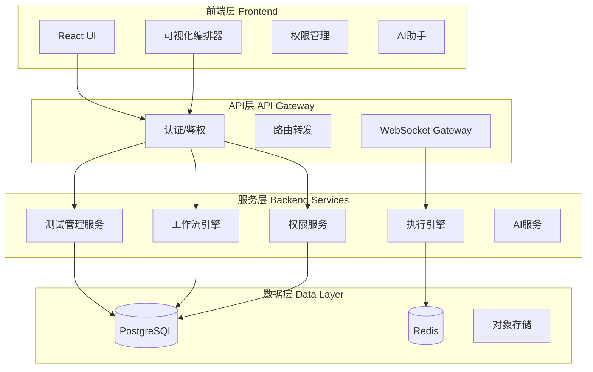

# 测试平台统一方案

**文档版本**: v1.0
**创建日期**: 2025-11-22
**目标**: 统一 NextTestPlatformUI (前端) 和 nextest-platform (后端) 成为一套完整的企业级自动化测试平台

---

## 📊 第一部分: 系统差异分析

### 1.1 架构差异对比

| 维度 | NextTestPlatformUI | nextest-platform | 差异性 |
|-----|-------------------|------------------|--------|
| **技术栈** | React 19 + TypeScript | Go 1.24 + Gin + GORM | 前后端分离架构 |
| **数据存储** | Mock Data + LocalStorage | SQLite/PostgreSQL/MySQL | 前端Mock vs 真实数据库 |
| **多租户** | ✅ Organization → Project | ❌ 无多租户概念 | **重大差异** |
| **权限系统** | ✅ RBAC (User/Role/Permission) | ❌ 无权限系统 | **重大差异** |
| **AI集成** | ✅ Gemini API | ❌ 无AI功能 | **功能缺失** |
| **实时推送** | ❌ 无WebSocket | ✅ WebSocket (Hub/Client) | **功能互补** |
| **脚本库** | ✅ 完整脚本管理 | ❌ 无脚本概念 | **重大差异** |
| **环境管理** | ✅ 多环境变量配置 | ✅ 环境变量注入 | 功能相似 |

### 1.2 数据模型差异

#### 前端 (TypeScript)
```typescript
TestCase {
  id, projectId, title, description, priority, status,
  steps: TestStep[],
  variables: Record<string, string>,
  automationType: 'MANUAL' | 'WORKFLOW',
  linkedWorkflowId: string,
  folderId: string,  // 文件夹组织
  tags: string[]
}

TestStep {
  id, instruction, expectedResult,
  condition: string,      // 条件执行
  loopOver: string,       // 循环变量
  linkedScriptId: string, // 绑定脚本
  outputMapping: Record<string, string>,
  linkedWorkflowId: string  // 调用子工作流
}

Workflow {
  id, projectId, name, description,
  nodes: WorkflowNode[],  // 节点数组
  inputSchema, outputSchema
}

WorkflowNode {
  id, type, name, config,
  children: WorkflowNode[],      // 子节点
  elseChildren: WorkflowNode[]   // Else分支
}

// 15+ 节点类型
NodeType = TEST_CASE | STEP | SCRIPT | LOOP | CONDITION |
           HTTP_REQUEST | DB_QUERY | REDIS_CMD | KAFKA_PUB |
           ES_QUERY | SHELL_CMD | BROWSER_ACTION | RPC_CALL |
           LLM_PROMPT | MCP_TOOL | CALL_WORKFLOW

Script {
  id, projectId, name, type, content,
  parameters: ScriptParameter[],
  outputs: ScriptParameter[],
  isTemplate: boolean
}
```

#### 后端 (Go)
```go
TestCase {
  ID, TestID, GroupID, Name, Type, Priority, Status,
  WorkflowID string,      // Mode 1: 引用工作流
  WorkflowDef JSONB,      // Mode 2: 内嵌工作流
  HTTPConfig, CommandConfig, Steps (JSONArray)
}

Workflow {
  ID, WorkflowID, Name, Version, Description,
  Definition JSONB,  // 完整工作流定义
  IsTestCase bool
}

WorkflowDefinition {
  Name, Version,
  Variables: map[string]interface{},
  Steps: map[string]*WorkflowStep  // Map结构
}

WorkflowStep {
  ID, Name, Type, Config,
  Input, Output,
  DependsOn: []string,    // DAG依赖
  When: string,           // 条件表达式
  Retry: *RetryConfig,
  OnError: string         // abort | continue
}

// 3种节点类型
Type = "http" | "command" | "test-case"
```

### 1.3 工作流模型核心差异

| 特性 | 前端模型 (树形结构) | 后端模型 (DAG结构) | 差异说明 |
|-----|-------------------|------------------|----------|
| **组织方式** | 节点数组 + children | Map + DependsOn | 前端树形 vs 后端图形 |
| **执行模式** | 递归遍历子节点 | DAG分层并行执行 | 执行逻辑完全不同 |
| **条件分支** | children + elseChildren | When条件 + 跳过 | 前端显式分支 vs 后端隐式 |
| **循环处理** | LOOP节点 + children | loopOver变量遍历 | 实现方式不同 |
| **脚本概念** | Script实体 + linkedScriptId | 无独立脚本概念 | **前端独有** |
| **节点类型** | 15+ 可视化节点类型 | 仅3种基础类型 | **丰富度差距巨大** |
| **输出映射** | outputTransform (节点级) | Output (步骤级) | 都支持，语法不同 |
| **子工作流** | CALL_WORKFLOW节点 | 可嵌套定义 | 都支持 |

---

## 🎯 第二部分: 统一目标

### 2.1 愿景
打造一个**企业级全栈自动化测试平台**，融合前端的可视化编排能力和后端的执行引擎，支持：
- 多租户 SaaS 模式
- 完整的 RBAC 权限体系
- 可视化工作流编排
- 强大的测试执行引擎
- AI 辅助测试设计
- 实时执行监控

### 2.2 核心原则
1. **数据模型统一**: 前后端使用相同的数据结构
2. **功能互补**: 保留两边优势功能
3. **渐进迁移**: 分阶段实施，降低风险
4. **向后兼容**: 尽量保持现有API兼容

### 2.3 技术架构目标


---

## 🔧 第三部分: 统一数据模型设计

### 3.1 核心实体统一

#### 3.1.1 TestCase (测试用例)
```typescript
// 统一后的模型 (前后端通用)
interface TestCase {
  // 基础信息
  id: string;
  testId: string;           // 业务ID
  projectId: string;        // 多租户: 项目ID
  orgId: string;            // 多租户: 组织ID

  // 元数据
  title: string;
  description: string;
  priority: 'P0' | 'P1' | 'P2' | 'P3';
  status: 'DRAFT' | 'ACTIVE' | 'DEPRECATED';
  tags: string[];

  // 组织结构
  folderId: string;         // 保留前端文件夹概念
  groupId: string;          // 兼容后端分组概念

  // 测试步骤
  steps: TestStep[];        // 手动测试步骤

  // 自动化配置
  automationType: 'MANUAL' | 'WORKFLOW' | 'HTTP' | 'COMMAND';

  // 工作流关联 (三种模式)
  linkedWorkflowId?: string;           // Mode 1: 引用独立工作流
  embeddedWorkflowDef?: WorkflowDef;   // Mode 2: 内嵌工作流定义

  // 快速测试配置 (Mode 3)
  httpConfig?: HTTPConfig;
  commandConfig?: CommandConfig;

  // 上下文
  variables?: Record<string, any>;      // 用例变量
  preconditions?: string[];             // 前置条件
  timeout?: number;                     // 超时(秒)

  // 时间戳
  createdAt: string;
  updatedAt: string;
  createdBy: string;
  updatedBy: string;
}
```

#### 3.1.2 Workflow (工作流) - **核心统一点**
```typescript
// 统一后的工作流模型
interface Workflow {
  // 基础信息
  id: string;
  workflowId: string;       // 业务ID
  projectId: string;
  name: string;
  description: string;
  version: string;

  // 工作流定义 (统一格式)
  definition: WorkflowDefinition;

  // 元数据
  isTemplate: boolean;      // 是否为模板
  isTestCase: boolean;      // 是否被测试用例引用
  category: string;         // 分类
  tags: string[];

  // 接口定义
  inputSchema?: ParameterSchema[];
  outputSchema?: ParameterSchema[];

  // 执行历史
  lastRunStatus?: 'success' | 'failed' | 'running';
  lastRunAt?: string;

  // 时间戳
  createdAt: string;
  updatedAt: string;
  createdBy: string;
}

// 统一的工作流定义格式
interface WorkflowDefinition {
  name: string;
  version: string;

  // 全局变量
  variables?: Record<string, any>;

  // 节点列表 (统一采用Map结构)
  nodes: Record<string, WorkflowNode>;

  // 执行配置
  timeout?: number;
  concurrency?: number;     // 并发度
  onError?: 'abort' | 'continue';
}

// 统一的节点模型 (融合前后端优势)
interface WorkflowNode {
  // 节点标识
  id: string;
  name: string;
  type: NodeType;

  // 依赖关系 (DAG模式 - 后端)
  dependsOn?: string[];     // 依赖的节点ID列表

  // 层次结构 (树形模式 - 前端可视化)
  children?: string[];      // 子节点ID (用于LOOP/CONDITION)
  elseChildren?: string[];  // Else分支节点ID

  // 条件控制
  when?: string;            // 条件表达式 (支持 {{variable}} 语法)

  // 循环控制
  loopOver?: string;        // 循环变量名
  loopVar?: string;         // 迭代变量名
  loopCount?: number;       // 循环次数

  // 重试配置
  retry?: {
    maxAttempts: number;
    interval: number;       // 毫秒
    backoff?: 'fixed' | 'exponential';
  };

  // 错误处理
  onError?: 'abort' | 'continue' | 'retry';

  // 节点配置 (根据type不同而不同)
  config: NodeConfig;

  // 输入/输出映射
  input?: Record<string, any>;           // 输入参数映射
  output?: Record<string, string>;       // 输出变量映射
  outputTransform?: Record<string, string>; // 输出路径映射
}

// 节点类型 (融合前后端)
enum NodeType {
  // 测试类
  TEST_CASE = 'TEST_CASE',
  TEST_STEP = 'TEST_STEP',

  // 脚本类 (前端独有)
  SCRIPT = 'SCRIPT',

  // 控制流
  LOOP = 'LOOP',
  CONDITION = 'CONDITION',
  CALL_WORKFLOW = 'CALL_WORKFLOW',

  // HTTP/API
  HTTP_REQUEST = 'HTTP_REQUEST',
  RPC_CALL = 'RPC_CALL',
  GRPC_CALL = 'GRPC_CALL',
  WEBSOCKET = 'WEBSOCKET',

  // 数据库
  DB_QUERY = 'DB_QUERY',
  REDIS_CMD = 'REDIS_CMD',
  ES_QUERY = 'ES_QUERY',

  // 消息队列
  KAFKA_PUB = 'KAFKA_PUB',
  KAFKA_SUB = 'KAFKA_SUB',

  // 系统
  SHELL_CMD = 'SHELL_CMD',
  BROWSER_ACTION = 'BROWSER_ACTION',

  // AI
  LLM_PROMPT = 'LLM_PROMPT',

  // 协议
  MCP_TOOL = 'MCP_TOOL',

  // 工具
  JSON_TRANSFORM = 'JSON_TRANSFORM',
  WAIT = 'WAIT',
  LOG = 'LOG'
}

// 节点配置 (联合类型)
type NodeConfig =
  | ScriptConfig
  | HTTPConfig
  | DBConfig
  | RedisConfig
  | KafkaConfig
  | ShellConfig
  | BrowserConfig
  | LLMConfig
  | TestCaseRefConfig;

interface ScriptConfig {
  scriptId: string;         // 脚本ID
  parameters?: Record<string, any>;
}

interface HTTPConfig {
  url: string;
  method: 'GET' | 'POST' | 'PUT' | 'DELETE' | 'PATCH';
  headers?: Record<string, string>;
  queryParams?: Record<string, string>;
  body?: any;
  timeout?: number;
  followRedirect?: boolean;
  validateCert?: boolean;
}

// ... 其他Config定义
```

#### 3.1.3 Script (脚本) - **前端功能补充到后端**
```typescript
interface Script {
  id: string;
  scriptId: string;
  projectId: string;
  name: string;
  description: string;
  type: 'PYTHON' | 'JAVASCRIPT' | 'SHELL';
  content: string;          // 脚本代码

  // 接口定义
  parameters: ParameterDef[];    // 输入参数
  outputs: ParameterDef[];       // 输出参数

  // 测试示例
  testExamples: TestExample[];

  // 元数据
  isTemplate: boolean;
  tags: string[];
  category: string;

  // 版本控制
  version: string;
  changelog: string;

  createdAt: string;
  updatedAt: string;
  createdBy: string;
}

interface ParameterDef {
  name: string;
  type: 'string' | 'number' | 'boolean' | 'object' | 'array';
  description: string;
  required: boolean;
  defaultValue?: any;
  schema?: JSONSchema;      // 复杂类型的Schema定义
}
```

#### 3.1.4 权限模型 - **后端需新增**
```typescript
interface User {
  id: string;
  name: string;
  email: string;
  avatar?: string;
  roleId: string;
  orgId: string;
  status: 'ACTIVE' | 'INACTIVE' | 'SUSPENDED';
  createdAt: string;
}

interface Role {
  id: string;
  name: string;
  description: string;
  permissionCodes: string[];
  isBuiltin: boolean;       // 系统内置角色不可删除
}

interface Permission {
  code: string;
  name: string;
  category: 'Menu' | 'Action' | 'System';
  description: string;
}

interface Organization {
  id: string;
  name: string;
  parentId?: string;        // 支持层级组织
  type: 'DEPARTMENT' | 'TEAM';
}

interface Project {
  id: string;
  orgId: string;
  name: string;
  key: string;              // 项目简称
  description: string;
  status: 'ACTIVE' | 'ARCHIVED';
}
```

### 3.2 执行相关模型

#### 3.2.1 TestRun (测试执行)
```typescript
interface TestRun {
  id: string;
  runId: string;
  projectId: string;

  // 执行来源
  caseId?: string;          // 单个测试用例
  groupId?: string;         // 批量执行
  workflowRunId?: string;   // 关联工作流执行

  // 执行状态
  status: 'PENDING' | 'RUNNING' | 'PASSED' | 'FAILED' | 'BLOCKED' | 'SKIPPED';

  // 时间信息
  startTime: string;
  endTime?: string;
  duration?: number;        // 毫秒

  // 结果统计
  total: number;
  passed: number;
  failed: number;
  errors: number;
  skipped: number;

  // 执行日志
  logs: string[];
  error?: string;

  // 环境信息
  environmentId: string;
  environmentName: string;

  // 执行人
  executedBy: string;

  createdAt: string;
}
```

#### 3.2.2 WorkflowRun (工作流执行)
```typescript
interface WorkflowRun {
  id: string;
  runId: string;
  workflowId: string;
  projectId: string;

  // 执行状态
  status: 'PENDING' | 'RUNNING' | 'SUCCESS' | 'FAILED' | 'CANCELLED';

  // 时间信息
  startTime: string;
  endTime?: string;
  duration?: number;

  // 步骤统计
  totalSteps: number;
  completedSteps: number;
  failedSteps: number;

  // 执行上下文
  context: {
    variables: Record<string, any>;     // 全局变量
    stepOutputs: Record<string, any>;   // 步骤输出
  };

  // 错误信息
  error?: string;

  // 执行人
  executedBy: string;

  createdAt: string;
}

interface WorkflowStepExecution {
  id: string;
  runId: string;
  stepId: string;
  stepName: string;

  status: 'PENDING' | 'RUNNING' | 'SUCCESS' | 'FAILED' | 'SKIPPED';

  startTime?: string;
  endTime?: string;
  duration?: number;

  // 数据快照
  inputData?: any;
  outputData?: any;

  error?: string;

  createdAt: string;
}

interface WorkflowStepLog {
  id: string;
  runId: string;
  stepId: string;
  level: 'DEBUG' | 'INFO' | 'WARN' | 'ERROR';
  message: string;
  timestamp: string;
}
```

---

## 🚀 第四部分: 实施方案

### 4.1 分阶段实施路线图

#### **Phase 1: 基础设施统一 (2-3周)**
**目标**: 建立统一的数据层和API层

1. **数据库Schema统一**
   ```sql
   -- 新增多租户表
   CREATE TABLE organizations (...);
   CREATE TABLE projects (...);

   -- 新增权限表
   CREATE TABLE users (...);
   CREATE TABLE roles (...);
   CREATE TABLE permissions (...);

   -- 新增脚本表
   CREATE TABLE scripts (...);

   -- 扩展现有表
   ALTER TABLE test_cases ADD COLUMN project_id VARCHAR(255);
   ALTER TABLE test_cases ADD COLUMN org_id VARCHAR(255);
   ALTER TABLE test_cases ADD COLUMN folder_id VARCHAR(255);
   ALTER TABLE workflows ADD COLUMN project_id VARCHAR(255);
   ```

2. **Go后端扩展**
   - 新增模型: User, Role, Permission, Organization, Project, Script
   - 新增Repository层
   - 新增Service层 (权限验证、脚本执行)
   - 新增Middleware (JWT认证、RBAC鉴权)

3. **API接口统一**
   ```go
   // 认证接口
   POST /api/v2/auth/login
   POST /api/v2/auth/logout
   POST /api/v2/auth/refresh

   // 多租户接口
   GET  /api/v2/organizations
   POST /api/v2/organizations
   GET  /api/v2/projects?orgId={orgId}
   POST /api/v2/projects

   // 权限接口
   GET  /api/v2/users
   POST /api/v2/users
   GET  /api/v2/roles
   POST /api/v2/roles

   // 脚本接口
   GET  /api/v2/scripts?projectId={projectId}
   POST /api/v2/scripts
   PUT  /api/v2/scripts/:id
   DELETE /api/v2/scripts/:id
   POST /api/v2/scripts/:id/execute
   ```

#### **Phase 2: 工作流模型统一 (3-4周)**
**目标**: 统一前后端工作流定义和执行引擎

1. **统一WorkflowDefinition结构**
   ```go
   // 修改 internal/workflow/types.go
   type WorkflowDefinition struct {
       Name      string                    `json:"name"`
       Version   string                    `json:"version"`
       Variables map[string]interface{}    `json:"variables"`
       Nodes     map[string]*WorkflowNode  `json:"nodes"`  // 改为Map
       Timeout   int                       `json:"timeout,omitempty"`
   }

   type WorkflowNode struct {
       ID        string                 `json:"id"`
       Name      string                 `json:"name"`
       Type      string                 `json:"type"`
       DependsOn []string               `json:"dependsOn,omitempty"`
       Children  []string               `json:"children,omitempty"`      // 新增
       ElseChildren []string            `json:"elseChildren,omitempty"`  // 新增
       When      string                 `json:"when,omitempty"`
       LoopOver  string                 `json:"loopOver,omitempty"`
       LoopVar   string                 `json:"loopVar,omitempty"`
       Retry     *RetryConfig           `json:"retry,omitempty"`
       OnError   string                 `json:"onError,omitempty"`
       Config    map[string]interface{} `json:"config"`
       Input     map[string]interface{} `json:"input,omitempty"`
       Output    map[string]string      `json:"output,omitempty"`
       OutputTransform map[string]string `json:"outputTransform,omitempty"`
   }
   ```

2. **扩展执行引擎支持新节点类型**
   ```go
   // internal/workflow/actions/ 下新增
   - script_action.go      // 脚本执行
   - db_action.go          // 数据库查询
   - redis_action.go       // Redis操作
   - kafka_action.go       // Kafka发布
   - shell_action.go       // Shell命令
   - browser_action.go     // 浏览器自动化
   - llm_action.go         // AI Prompt
   - mcp_action.go         // MCP工具调用
   ```

3. **DAG执行器增强**
   ```go
   // 支持 children/elseChildren 的树形执行
   // 保持原有 dependsOn 的DAG执行
   // 两种模式可混用

   func (e *Executor) executeNode(ctx *ExecutionContext, node *WorkflowNode) error {
       // 1. 检查条件 (when)
       if !evaluateCondition(node.When, ctx) {
           return nil // 跳过
       }

       // 2. 执行节点动作
       result, err := e.executeAction(node, ctx)

       // 3. 处理循环
       if node.LoopOver != "" {
           return e.executeLoop(node, ctx)
       }

       // 4. 处理条件分支
       if node.Type == "CONDITION" {
           if result.Success {
               return e.executeChildren(node.Children, ctx)
           } else {
               return e.executeChildren(node.ElseChildren, ctx)
           }
       }

       // 5. 处理普通子节点
       if len(node.Children) > 0 {
           return e.executeChildren(node.Children, ctx)
       }

       return nil
   }
   ```

#### **Phase 3: 前端对接后端API (2周)**
**目标**: 前端从Mock数据切换到真实API

1. **创建API Client层**
   ```typescript
   // services/api-client.ts
   class ApiClient {
     private baseURL: string;
     private token: string;

     async login(email: string, password: string): Promise<User>
     async getTestCases(projectId: string): Promise<TestCase[]>
     async createTestCase(data: CreateTestCaseDto): Promise<TestCase>
     async executeWorkflow(workflowId: string): Promise<WorkflowRun>
     // ... 其他API方法
   }
   ```

2. **WebSocket集成**
   ```typescript
   // services/websocket-client.ts
   class WorkflowExecutionMonitor {
     connect(runId: string) {
       const ws = new WebSocket(`ws://localhost:8090/api/v2/workflows/runs/${runId}/stream`);

       ws.onmessage = (event) => {
         const message = JSON.parse(event.data);
         switch (message.type) {
           case 'step_start':
             // 更新UI
             break;
           case 'step_log':
             // 添加日志
             break;
           case 'step_complete':
             // 更新步骤状态
             break;
         }
       };
     }
   }
   ```

3. **逐步替换Mock数据**
   ```typescript
   // hooks/useAppState.ts
   const useAppState = () => {
     const [cases, setCases] = useState<TestCase[]>([]);

     useEffect(() => {
       if (USE_REAL_API) {
         apiClient.getTestCases(activeProjectId).then(setCases);
       } else {
         setCases(MOCK_CASES);
       }
     }, [activeProjectId]);
   };
   ```

#### **Phase 4: AI集成到后端 (2周)**
**目标**: 将Gemini AI能力迁移到后端

1. **Go后端集成Gemini**
   ```go
   // internal/ai/gemini_service.go
   type GeminiService struct {
       apiKey string
       client *genai.Client
   }

   func (s *GeminiService) GenerateTestCase(description string) (*models.TestCase, error)
   func (s *GeminiService) AnalyzeTestReport(runs []models.TestRun) (string, error)
   func (s *GeminiService) ChatWithCopilot(logs []string, question string) (string, error)
   ```

2. **新增AI API端点**
   ```go
   POST /api/v2/ai/generate-testcase
   POST /api/v2/ai/analyze-report
   POST /api/v2/ai/chat
   ```

3. **前端调用后端AI接口**
   ```typescript
   const generateTestCase = async (description: string) => {
     const response = await apiClient.post('/ai/generate-testcase', { description });
     return response.data.testCase;
   };
   ```

#### **Phase 5: 高级功能完善 (3-4周)**
**目标**: 完善企业级功能

1. **定时任务调度**
   ```go
   // 使用 robfig/cron
   type ScheduledJob struct {
       ID         string
       ProjectID  string
       CaseID     string
       Cron       string
       Enabled    bool
   }
   ```

2. **测试报告生成**
   ```go
   // PDF/HTML报告导出
   type ReportGenerator interface {
       GeneratePDF(runId string) ([]byte, error)
       GenerateHTML(runId string) (string, error)
   }
   ```

3. **Webhook通知**
   ```go
   type WebhookConfig struct {
       URL     string
       Events  []string  // run_completed, run_failed
       Headers map[string]string
   }
   ```

4. **审计日志**
   ```sql
   CREATE TABLE audit_logs (
       id BIGSERIAL PRIMARY KEY,
       user_id VARCHAR(255),
       action VARCHAR(100),
       resource_type VARCHAR(50),
       resource_id VARCHAR(255),
       changes JSONB,
       ip_address VARCHAR(45),
       created_at TIMESTAMP
   );
   ```

### 4.2 数据迁移策略

#### 4.2.1 从Mock到真实数据库
```typescript
// migration-script.ts
async function migrateMockDataToBackend() {
  const mockCases = MOCK_CASES;
  const mockScripts = MOCK_SCRIPTS;
  const mockWorkflows = MOCK_WORKFLOWS;

  // 1. 创建组织和项目
  const org = await apiClient.createOrganization({ name: "Default Org" });
  const project = await apiClient.createProject({
    orgId: org.id,
    name: "Default Project",
    key: "DEF"
  });

  // 2. 迁移脚本
  for (const script of mockScripts) {
    await apiClient.createScript({
      ...script,
      projectId: project.id
    });
  }

  // 3. 迁移工作流
  for (const workflow of mockWorkflows) {
    await apiClient.createWorkflow({
      ...workflow,
      projectId: project.id
    });
  }

  // 4. 迁移测试用例
  for (const testCase of mockCases) {
    await apiClient.createTestCase({
      ...testCase,
      projectId: project.id,
      orgId: org.id
    });
  }
}
```

#### 4.2.2 兼容性处理
```go
// 后端API支持多种格式
func (h *WorkflowHandler) CreateWorkflow(c *gin.Context) {
    var req struct {
        // 兼容旧格式 (Steps Map)
        Steps map[string]*WorkflowStep `json:"steps,omitempty"`

        // 新格式 (Nodes Map)
        Nodes map[string]*WorkflowNode `json:"nodes,omitempty"`
    }

    if err := c.ShouldBindJSON(&req); err != nil {
        c.JSON(400, gin.H{"error": err.Error()})
        return
    }

    // 自动转换
    if req.Steps != nil && req.Nodes == nil {
        req.Nodes = convertStepsToNodes(req.Steps)
    }

    // 保存
    workflow := &models.Workflow{
        Definition: req.Nodes,
    }
    // ...
}
```

### 4.3 性能优化策略

1. **数据库优化**
   - 索引优化 (projectId, orgId, status等)
   - 分页查询
   - 连接池配置

2. **API优化**
   - GraphQL支持 (按需查询)
   - 数据缓存 (Redis)
   - API限流

3. **WebSocket优化**
   - 消息压缩
   - 连接池管理
   - 自动重连

---

## 📝 第五部分: API接口清单

### 5.1 认证与授权
```
POST   /api/v2/auth/login
POST   /api/v2/auth/logout
POST   /api/v2/auth/refresh
GET    /api/v2/auth/me
```

### 5.2 多租户管理
```
GET    /api/v2/organizations
POST   /api/v2/organizations
GET    /api/v2/organizations/:id
PUT    /api/v2/organizations/:id
DELETE /api/v2/organizations/:id

GET    /api/v2/projects?orgId={orgId}
POST   /api/v2/projects
GET    /api/v2/projects/:id
PUT    /api/v2/projects/:id
DELETE /api/v2/projects/:id
```

### 5.3 用户与权限
```
GET    /api/v2/users?orgId={orgId}
POST   /api/v2/users
GET    /api/v2/users/:id
PUT    /api/v2/users/:id
DELETE /api/v2/users/:id

GET    /api/v2/roles
POST   /api/v2/roles
PUT    /api/v2/roles/:id
DELETE /api/v2/roles/:id

GET    /api/v2/permissions
```

### 5.4 测试用例管理
```
GET    /api/v2/testcases?projectId={projectId}&folderId={folderId}
POST   /api/v2/testcases
GET    /api/v2/testcases/:id
PUT    /api/v2/testcases/:id
DELETE /api/v2/testcases/:id
POST   /api/v2/testcases/:id/execute

GET    /api/v2/folders/tree?projectId={projectId}
POST   /api/v2/folders
PUT    /api/v2/folders/:id
DELETE /api/v2/folders/:id
```

### 5.5 脚本管理
```
GET    /api/v2/scripts?projectId={projectId}
POST   /api/v2/scripts
GET    /api/v2/scripts/:id
PUT    /api/v2/scripts/:id
DELETE /api/v2/scripts/:id
POST   /api/v2/scripts/:id/execute
POST   /api/v2/scripts/:id/test
```

### 5.6 工作流管理
```
GET    /api/v2/workflows?projectId={projectId}
POST   /api/v2/workflows
GET    /api/v2/workflows/:id
PUT    /api/v2/workflows/:id
DELETE /api/v2/workflows/:id
POST   /api/v2/workflows/:id/execute
POST   /api/v2/workflows/:id/validate

GET    /api/v2/workflows/runs/:runId
GET    /api/v2/workflows/runs?workflowId={workflowId}
WS     /api/v2/workflows/runs/:runId/stream
POST   /api/v2/workflows/runs/:runId/cancel
```

### 5.7 环境管理
```
GET    /api/v2/environments?projectId={projectId}
POST   /api/v2/environments
GET    /api/v2/environments/:id
PUT    /api/v2/environments/:id
DELETE /api/v2/environments/:id
POST   /api/v2/environments/:id/activate
```

### 5.8 AI服务
```
POST   /api/v2/ai/generate-testcase
POST   /api/v2/ai/analyze-report
POST   /api/v2/ai/chat
POST   /api/v2/ai/suggest-assertions
```

---

## 🎨 第六部分: 前端改造要点

### 6.1 状态管理调整
```typescript
// 从 useAppState.ts 改为 Redux/Zustand
import create from 'zustand';

interface AppState {
  // 认证状态
  currentUser: User | null;
  token: string | null;

  // 多租户上下文
  activeOrgId: string;
  activeProjectId: string;

  // 数据缓存
  testCases: TestCase[];
  workflows: Workflow[];
  scripts: Script[];

  // 操作方法
  login: (email: string, password: string) => Promise<void>;
  logout: () => void;
  switchProject: (projectId: string) => void;
  fetchTestCases: () => Promise<void>;
  createTestCase: (data: CreateTestCaseDto) => Promise<TestCase>;
}

const useAppStore = create<AppState>((set, get) => ({
  // 实现
}));
```

### 6.2 可视化工作流编排器增强
```typescript
// components/workflow-builder/FlowEditor.tsx
import ReactFlow, { Node, Edge } from 'reactflow';

// 支持后端统一格式
interface FlowNode extends Node {
  data: {
    nodeId: string;
    type: NodeType;
    config: NodeConfig;
    dependsOn: string[];    // DAG依赖
    children: string[];     // 树形子节点
  };
}

// 双向转换
function convertToBackendFormat(nodes: FlowNode[]): WorkflowDefinition {
  return {
    nodes: nodes.reduce((acc, node) => {
      acc[node.data.nodeId] = {
        id: node.data.nodeId,
        type: node.data.type,
        config: node.data.config,
        dependsOn: node.data.dependsOn,
        children: node.data.children,
      };
      return acc;
    }, {})
  };
}
```

### 6.3 实时执行监控
```typescript
// components/execution/ExecutionMonitor.tsx
const ExecutionMonitor = ({ runId }: { runId: string }) => {
  const [logs, setLogs] = useState<StepLog[]>([]);
  const [stepStatuses, setStepStatuses] = useState<Record<string, string>>({});

  useEffect(() => {
    const ws = new WebSocket(`ws://localhost:8090/api/v2/workflows/runs/${runId}/stream`);

    ws.onmessage = (event) => {
      const msg = JSON.parse(event.data);

      if (msg.type === 'step_log') {
        setLogs(prev => [...prev, msg.payload]);
      } else if (msg.type === 'step_complete') {
        setStepStatuses(prev => ({
          ...prev,
          [msg.payload.stepId]: msg.payload.status
        }));
      }
    };

    return () => ws.close();
  }, [runId]);

  return (
    <div>
      <StepStatusView statuses={stepStatuses} />
      <LogViewer logs={logs} />
    </div>
  );
};
```

---

## ⚠️ 第七部分: 风险与挑战

### 7.1 技术风险
| 风险 | 影响 | 缓解措施 |
|-----|------|---------|
| 数据模型不兼容 | 高 | 提供转换层、兼容旧格式 |
| 性能下降 | 中 | 性能测试、优化查询、缓存 |
| WebSocket连接稳定性 | 中 | 自动重连、降级方案 |
| 前端打包体积增大 | 低 | 代码分割、懒加载 |

### 7.2 业务风险
| 风险 | 影响 | 缓解措施 |
|-----|------|---------|
| 用户学习成本 | 中 | 提供迁移指南、视频教程 |
| 数据迁移失败 | 高 | 备份机制、回滚方案 |
| 功能缺失 | 中 | 分阶段发布、Beta测试 |

### 7.3 资源风险
| 风险 | 影响 | 缓解措施 |
|-----|------|---------|
| 开发周期延长 | 中 | 灵活调整优先级 |
| 人力不足 | 高 | 招聘外部资源、简化需求 |

---

## ✅ 第八部分: 验收标准

### 8.1 功能验收
- [ ] 用户可以使用前端UI完成完整的测试用例创建和执行流程
- [ ] 前端可视化编排器创建的工作流能在后端正确执行
- [ ] WebSocket实时推送日志无延迟、无丢失
- [ ] 多租户数据隔离有效，无跨项目数据泄露
- [ ] RBAC权限验证正确，无权限绕过
- [ ] AI功能与原Mock数据效果一致

### 8.2 性能验收
- [ ] API响应时间 P95 < 500ms
- [ ] WebSocket消息延迟 < 100ms
- [ ] 支持1000+ 并发WebSocket连接
- [ ] 支持10000+ 测试用例查询无性能问题
- [ ] 工作流执行效率不低于原系统

### 8.3 兼容性验收
- [ ] 原nextest-platform API保持向后兼容
- [ ] 原NextTestPlatformUI的Mock数据可平滑迁移
- [ ] 支持Chrome/Firefox/Edge最新版本

---

## 📚 第九部分: 附录

### 附录A: 技术选型对比
| 技术点 | 方案A | 方案B | 推荐 | 理由 |
|-------|-------|-------|------|------|
| 权限框架 | Casbin | 自研 | Casbin | 成熟、灵活 |
| 任务调度 | robfig/cron | 自研 | robfig/cron | 久经考验 |
| WebSocket库 | gorilla/websocket | golang.org/x/net/websocket | gorilla | 功能更全 |
| 前端状态管理 | Redux | Zustand | Zustand | 更轻量 |
| 工作流编排UI | ReactFlow | 自研 | ReactFlow | 社区活跃 |

### 附录B: 参考资料
- Nextest Platform Documentation
- n8n Workflow Engine Architecture
- Airflow DAG Execution Model
- RBAC Best Practices

---

**文档结束**
