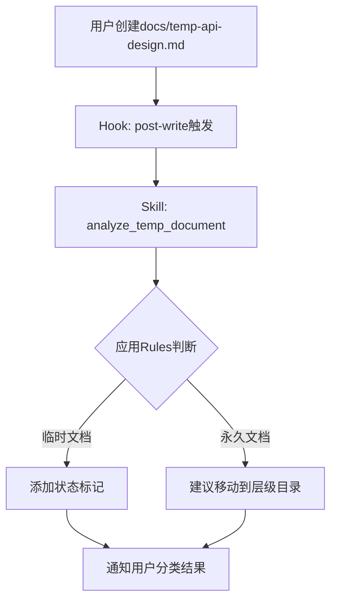
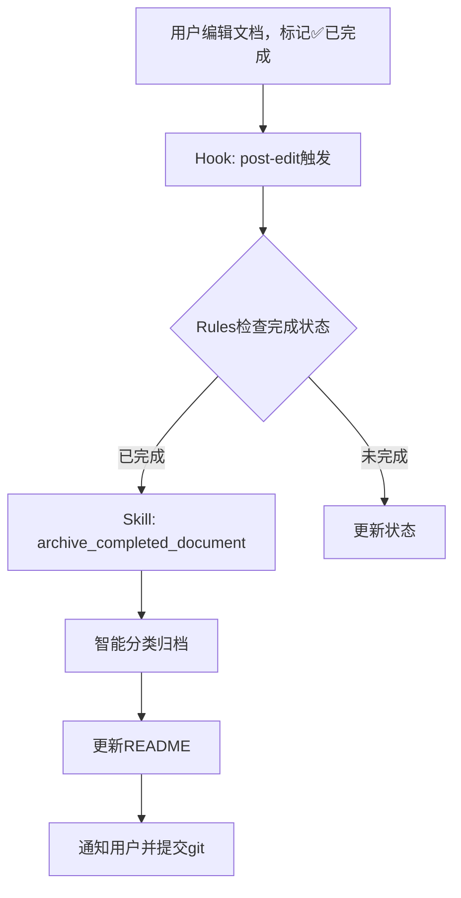
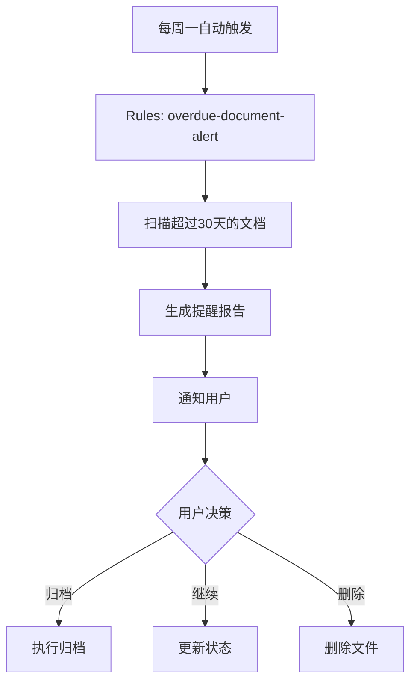

# 文档自动清理规则 (Claude Code)

**版本**: 1.0
**最后更新**: 2025-11-26
**技术栈**: Claude Code Hooks + Skills + Rules

---

## 🎯 设计思路

利用Claude Code的能力，实现**智能化、自动化**的文档管理，而非传统脚本。

### 核心理念

```
传统方案: 定时脚本扫描 → 模式匹配 → 手动归档
Claude方案: 监听事件 → 智能判断 → 自动处理
```

---

## 1. 基于Hooks的实时监听

### 1.1 文件创建Hook

**.claude/hooks/post-write.sh**

```bash
#!/bin/bash
# 文件写入后触发

FILE_PATH=$1
FILENAME=$(basename "$FILE_PATH")

# 仅处理docs/根目录的.md文件
if [[ "$FILE_PATH" == docs/*.md ]] && [[ "$FILE_PATH" != *"/"* ]]; then
    # 触发Claude分析
    echo "CLAUDE_TASK: analyze_temp_document $FILE_PATH"
fi
```

### 1.2 文件修改Hook

**.claude/hooks/post-edit.sh**

```bash
#!/bin/bash
# 文件编辑后检查状态变化

FILE_PATH=$1

# 检查是否标记为"已完成"
if grep -q "状态.*已完成" "$FILE_PATH" 2>/dev/null; then
    echo "CLAUDE_TASK: archive_completed_document $FILE_PATH"
fi
```

---

## 2. 基于Skills的智能处理

### 2.1 Skill: analyze_temp_document

**.claude/skills/analyze-temp-document.md**

```markdown
---
name: analyze-temp-document
description: 智能分析新创建的文档，判断是否为临时文档
---

# 分析临时文档

当docs/根目录创建新文档时，自动执行此Skill。

## 任务步骤

1. **读取文档内容**
   - 读取文件头部（前50行）
   - 识别文档元数据

2. **智能判断文档类型**

   判断标准:
   - ✅ 临时文档特征：
     - 文件名包含: temp-, todo-, analysis-, migration-, compliance-
     - 内容包含: "临时", "待办", "TODO", "分析报告"
     - 有明确的完成时间标记

   - ✅ 永久文档特征：
     - 文件名: README.md, directory-standards.md
     - 内容包含: "版本", "规范", "标准"
     - 没有完成时间标记

3. **提供建议**

   如果是临时文档:
   - 建议添加状态标记
   - 建议添加完成时间
   - 建议使用标准前缀命名

   如果是永久文档:
   - 建议移动到合适的层级目录

4. **自动标记**

   在文件头部自动添加:
   ```markdown
   **文档类型**: 临时/永久
   **清理规则**: 30天后归档/无
   **状态**: 进行中
   ```

## 示例对话

用户: "我创建了一个新文档 docs/api-migration-plan.md"

Claude:
> 我注意到你在docs/根目录创建了新文档。
>
> 根据文件名分析，这是一个**临时文档**（包含"migration"和"plan"关键词）。
>
> 建议操作：
> 1. 重命名为: `migration-plan-api.md` (符合命名规范)
> 2. 添加状态标记: `**状态**: 进行中`
> 3. 添加完成时间: `**预计完成**: 2025-12-01`
>
> 完成后会自动归档到 `docs/7-archive/planning-archives/`
>
> 是否需要我帮你添加这些标记？

```

---

### 2.2 Skill: archive_completed_document

**.claude/skills/archive-completed-document.md**

```markdown
---
name: archive-completed-document
description: 自动归档标记为"已完成"的临时文档
---

# 归档已完成文档

当检测到文档状态变更为"已完成"时，自动执行归档。

## 任务步骤

1. **确认文档状态**
   - 读取文档，确认包含 "状态: ✅ 已完成"
   - 确认文档类型为临时文档

2. **智能分类**

   根据文档内容和文件名判断归档类别:
   - `migration-*` → migration-records/
   - `analysis-*`, `*-report` → analysis-reports/
   - `todo-*`, `*-plan` → planning-archives/
   - 其他 → misc/

3. **执行归档**
   - 移动文件到归档目录
   - 更新归档目录的README.md
   - 添加归档记录到git

4. **通知用户**

   ```
   ✅ 文档已归档

   文件: api-migration-plan.md
   归档位置: docs/7-archive/planning-archives/2025-11/
   归档时间: 2025-11-26

   归档记录已添加到git staging area。
   建议运行 `git commit` 提交更改。
   ```

## 自动触发条件

- 文件编辑后检测到状态变为"已完成"
- 文件创建后30天仍未完成
- 用户手动请求归档

```

---

## 3. 基于Rules的决策引擎

### 3.1 文档分类规则

**.claude/rules/document-classification.rules**

```yaml
version: 1.0
name: Document Classification Rules

rules:
  # 规则1: 临时文档识别
  - id: temp-doc-by-filename
    description: 通过文件名识别临时文档
    pattern:
      file_name:
        regex: "^(temp-|todo-|analysis-|migration-|compliance-|.*-(plan|report|todo))\.md$"
    action:
      classification: temporary
      suggestion: add_status_marker
      retention_days: 30

  # 规则2: 永久文档识别
  - id: permanent-doc-by-filename
    description: 识别永久文档
    pattern:
      file_name:
        exact: ["README.md", "directory-standards.md"]
    action:
      classification: permanent
      retention: forever

  # 规则3: 基于内容的分类
  - id: temp-doc-by-content
    description: 通过内容特征识别临时文档
    pattern:
      content:
        contains_any: ["临时文档", "TODO:", "待办清单", "完成时间"]
    action:
      classification: temporary
      suggestion: move_to_root_if_in_layer

  # 规则4: 自动归档触发
  - id: auto-archive-completed
    description: 自动归档已完成文档
    pattern:
      content:
        contains: "状态.*✅.*完成"
      classification: temporary
    action:
      trigger: archive_document
      notify_user: true

  # 规则5: 超期文档提醒
  - id: overdue-document-alert
    description: 提醒超过保留期的文档
    pattern:
      age_days: "> 30"
      classification: temporary
      status: "!= 已完成"
    action:
      alert: |
        文档 {{filename}} 已创建超过30天，但尚未标记为完成。

        建议操作:
        1. 如果任务已完成，请标记为"✅ 已完成"
        2. 如果仍在进行，请更新进度
        3. 如果不再需要，请归档或删除
      frequency: weekly
```

---

### 3.2 归档分类规则

**.claude/rules/archive-classification.rules**

```yaml
version: 1.0
name: Archive Classification Rules

rules:
  # 迁移记录
  - id: migration-records
    pattern:
      file_name:
        regex: "^migration-|.*-migration-"
      content_keywords: ["迁移", "migration", "搬迁"]
    archive_to: "7-archive/migration-records/{{YYYY-MM}}/"

  # 分析报告
  - id: analysis-reports
    pattern:
      file_name:
        regex: "^analysis-|.*-report\.md$"
      content_keywords: ["分析", "报告", "analysis", "report"]
    archive_to: "7-archive/analysis-reports/{{YYYY-MM}}/"

  # 计划归档
  - id: planning-archives
    pattern:
      file_name:
        regex: "^todo-|.*-plan\.md$|.*-todo\.md$"
      content_keywords: ["计划", "待办", "plan", "todo"]
    archive_to: "7-archive/planning-archives/{{YYYY-MM}}/"

  # 其他
  - id: misc-archives
    pattern:
      default: true
    archive_to: "7-archive/misc/{{YYYY-MM}}/"
```

---

## 4. Slash Command快捷操作

### 4.1 定义Slash Commands

**.claude/commands/cleanup-docs.md**

```markdown
---
command: /cleanup-docs
description: 清理和归档临时文档
---

# 文档清理命令

执行文档清理和归档操作。

## 使用方式

\`\`\`
/cleanup-docs [选项]
\`\`\`

## 选项

- `check` - 检查可清理的文档
- `archive` - 归档已完成的文档
- `suggest` - 提供清理建议

## 执行流程

1. 扫描docs/根目录的.md文件
2. 应用分类规则（document-classification.rules）
3. 生成清理建议报告
4. 如果是archive模式，执行归档操作
5. 更新归档目录的README
6. 提交到git staging area

## 输出示例

\`\`\`
📊 文档清理报告

扫描路径: docs/
发现文档: 2个

临时文档:
  ✅ 可归档 (已完成):
    - migration-plan-api.md (已完成30天)

  ⏳ 进行中:
    - todo-database-refactor.md (创建10天前)

建议操作:
  1. 归档 migration-plan-api.md
  2. todo-database-refactor.md 仍在进行中，保留

是否执行归档? (y/N)
\`\`\`
```

---

## 5. 完整工作流

### 场景1: 创建新文档



### 场景2: 标记完成



### 场景3: 定期清理



---

## 6. 优势对比

| 特性 | 传统脚本方案 | Claude Code方案 |
|-----|------------|----------------|
| **触发方式** | 定时cron | 实时Hook事件 |
| **判断逻辑** | 正则匹配 | AI智能理解内容 |
| **分类准确性** | 基于文件名 | 综合文件名+内容+上下文 |
| **用户体验** | 被动执行 | 主动建议+用户确认 |
| **可扩展性** | 修改脚本 | 添加Rules规则 |
| **错误处理** | 脚本错误难追踪 | Claude交互式确认 |
| **学习能力** | 无 | 根据用户反馈改进 |

---

## 7. 实施步骤

### 阶段1: 基础Hooks (立即实施)

```bash
# 1. 创建hooks目录
mkdir -p .claude/hooks

# 2. 创建post-write hook
cat > .claude/hooks/post-write.sh << 'EOF'
#!/bin/bash
FILE_PATH=$1
if [[ "$FILE_PATH" == docs/*.md ]]; then
    echo "CLAUDE_ANALYZE: $FILE_PATH"
fi
EOF

chmod +x .claude/hooks/post-write.sh
```

### 阶段2: Skills开发 (1周内)

- [ ] 创建analyze-temp-document skill
- [ ] 创建archive-completed-document skill
- [ ] 测试skill工作流

### 阶段3: Rules引擎 (2周内)

- [ ] 定义分类规则YAML
- [ ] 实现规则解析器
- [ ] 集成到Claude workflow

### 阶段4: Slash Commands (1个月内)

- [ ] 实现/cleanup-docs命令
- [ ] 实现/archive-doc命令
- [ ] 添加快捷操作

---

## 8. 配置示例

**.claude/config.yml**

```yaml
# 文档管理配置

document_management:
  enabled: true

  # Hooks配置
  hooks:
    post_write:
      - analyze_temp_document
    post_edit:
      - check_completion_status

  # 自动归档配置
  auto_archive:
    enabled: true
    retention_days: 30
    check_frequency: weekly
    notify_before_archive: true

  # 分类规则
  classification:
    rules_file: .claude/rules/document-classification.rules

  # 归档配置
  archive:
    base_path: docs/7-archive
    organize_by: category_and_date  # category_and_date | date_only
    update_readme: true
```

---

**维护者**: Claude Code团队
**最后更新**: 2025-11-26
