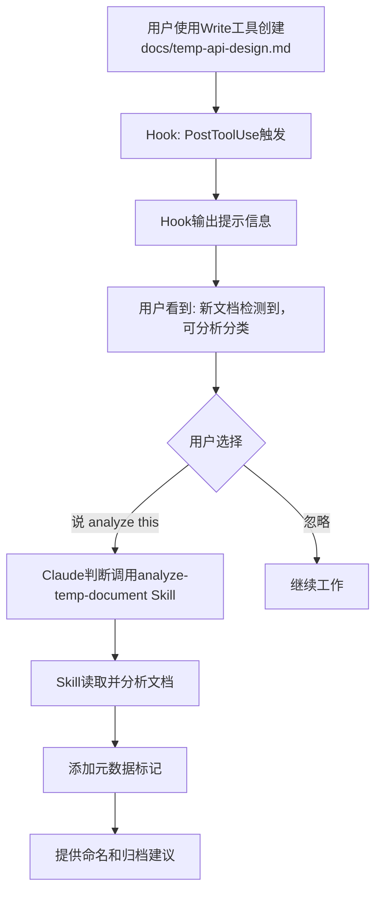
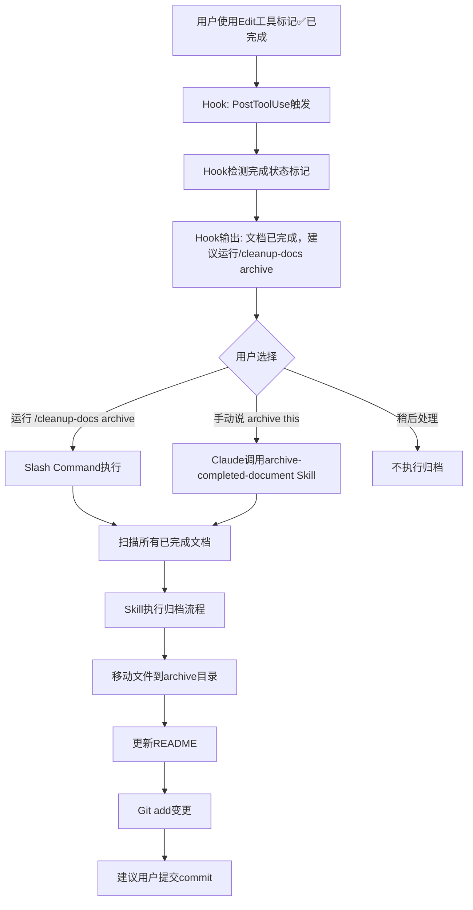
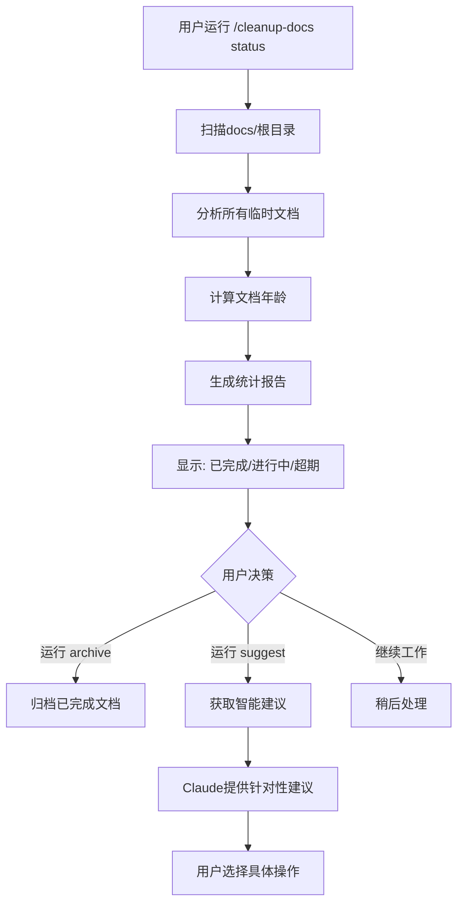

# 文档自动清理规则 (Claude Code)

**版本**: 2.0 - 实际实现版本
**最后更新**: 2025-11-26
**技术栈**: Claude Code Hooks + Skills + Slash Commands
**实现状态**: ✅ Phase 1 已完成并可用

---

## 🎯 设计思路

利用Claude Code的**原生能力**，实现**智能化、自动化**的文档管理，而非传统脚本。

### 核心理念

```
传统方案: 定时脚本扫描 → 模式匹配 → 手动归档
Claude方案: 实时Hook监听 → AI智能分析 → 交互式处理
```

### 架构对比

**原设计** (理论方案):
```
Hooks(shell脚本) → Skills(AI分析) → Rules引擎(YAML) → 自动归档
```

**实际实现** (基于Claude Code实际能力):
```
Hooks(settings.json) → Skills(AI分析) → Slash Commands(用户控制) → 交互式归档
```

**关键差异**:
- ❌ 无独立Rules引擎 → ✅ 规则逻辑内置于Skills
- ❌ Shell脚本Hook → ✅ JSON配置Hook
- ❌ 全自动归档 → ✅ AI建议 + 用户确认

---

## 1. 基于Hooks的实时监听

### 实际实现方式

Claude Code的Hooks通过 `.claude/settings.json` 配置，而非独立的shell脚本文件。

### 1.1 Hooks配置文件

**.claude/settings.json**

```json
{
  "hooks": {
    "PostToolUse": [
      {
        "matcher": "Write",
        "description": "Monitor new document creation in docs/ directory",
        "hooks": [
          {
            "type": "command",
            "command": "bash -c 'input=$(cat); file_path=$(echo \"$input\" | jq -r \".params.file_path // empty\"); if [[ \"$file_path\" =~ ^docs/[^/]+\\.md$ ]] && [[ \"$file_path\" != \"docs/README.md\" ]] && [[ \"$file_path\" != \"docs/directory-standards.md\" ]]; then echo \"📋 New document detected: $file_path\"; echo \"💡 Tip: Claude can analyze this document to determine if it is temporary or permanent.\"; echo \"💡 Type \\\"analyze this document\\\" to classify it.\"; fi'"
          }
        ]
      },
      {
        "matcher": "Edit",
        "description": "Check for completion status changes in documents",
        "hooks": [
          {
            "type": "command",
            "command": "bash -c 'input=$(cat); file_path=$(echo \"$input\" | jq -r \".params.file_path // empty\"); new_string=$(echo \"$input\" | jq -r \".params.new_string // empty\"); if [[ \"$file_path\" =~ ^docs/[^/]+\\.md$ ]] && [[ \"$new_string\" =~ (状态.*✅.*已完成|Status.*✅.*Complete) ]]; then echo \"✅ Document marked as complete: $file_path\"; echo \"💡 Tip: Run /cleanup-docs archive to archive completed documents.\"; fi'"
          }
        ]
      }
    ]
  },
  "description": "Document lifecycle management hooks",
  "version": "1.0"
}
```

### Hook工作原理

1. **PostToolUse触发**: 当Claude使用Write或Edit工具后触发
2. **JSON输入解析**: Hook通过stdin接收工具调用的JSON数据
3. **条件检查**: 使用jq解析文件路径和内容
4. **用户提醒**: 输出提示信息，建议用户采取行动
5. **非阻塞**: Hook仅提示，不自动执行归档（需用户确认）

### 与原设计的差异

| 特性 | 原设计 | 实际实现 |
|-----|--------|----------|
| Hook位置 | `.claude/hooks/*.sh` | `.claude/settings.json` |
| 触发时机 | 文件系统事件 | Tool使用事件 |
| 配置格式 | Bash脚本 | JSON + 内联命令 |
| 自动化程度 | 自动触发Skill | 提示用户采取行动 |

---

## 2. 基于Skills的智能处理

### 实际实现位置

Skills存储在 `.claude/skills/` 目录，每个Skill是一个包含`SKILL.md`文件的子目录。

### 2.1 Skill: analyze-temp-document

**.claude/skills/analyze-temp-document/SKILL.md**

**Frontmatter**:
```markdown
---
name: analyze-temp-document
description: Automatically analyze newly created documents in docs/ to classify them as temporary or permanent, and add appropriate metadata markers
allowed-tools: Read, Edit, Write
version: "1.0"
---
```

**功能说明**:

当新文档创建时，Claude会基于description自动判断是否应该调用此Skill。

**工作流程**:
1. 读取文档内容
2. 分析文件名模式（temp-, todo-, analysis-, migration-等）
3. 分析内容关键词（"临时", "TODO:", "待办"等）
4. 分类为临时或永久文档
5. 添加元数据标记到文档头部
6. 提供建议（命名规范、归档时间等）

**添加的元数据示例**:
```markdown
**文档类型**: 临时文档
**清理规则**: 完成后归档到 `docs/7-archive/`
**状态**: 🔄 进行中
**创建时间**: 2025-11-26
**预计完成**: 2025-12-15
```

**触发方式**:
- 自动: Claude检测到文档创建后判断是否相关
- 手动: 用户说"分析这个文档"或"classify this document"

---

### 2.2 Skill: archive-completed-document

**.claude/skills/archive-completed-document/SKILL.md**

**Frontmatter**:
```markdown
---
name: archive-completed-document
description: Automatically archive temporary documents marked as completed by moving them to appropriate archive directories and updating archive records
allowed-tools: Read, Bash, Edit, Write
version: "1.0"
---
```

**功能说明**:

当文档标记为"✅ 已完成"时，将其归档到合适的分类目录。

**工作流程**:
1. 确认文档包含完成状态标记
2. 根据文件名和内容确定归档分类:
   - `migration-*` → `7-archive/migration-records/YYYY-MM/`
   - `analysis-*`, `*-report` → `7-archive/analysis-reports/YYYY-MM/`
   - `todo-*`, `*-plan` → `7-archive/planning-archives/YYYY-MM/`
   - 其他 → `7-archive/misc/YYYY-MM/`
3. 创建归档目录（按月份）
4. 移动文件
5. 更新归档目录的README.md
6. Git add变更
7. 通知用户并建议commit命令

**触发方式**:
- 手动: 用户使用 `/cleanup-docs archive` 命令
- 手动: 用户说"归档这个文档"或"archive this"

---

### 与原设计的差异

| 特性 | 原设计 | 实际实现 |
|-----|--------|----------|
| Skill位置 | `.claude/skills/*.md` | `.claude/skills/*/SKILL.md` |
| 触发机制 | Hook自动调用 | Claude智能判断 + 用户调用 |
| 元数据格式 | YAML frontmatter | Markdown文本块 |
| 自动化程度 | 全自动 | AI建议 + 用户确认 |

**优势**: Claude可以理解上下文，比规则引擎更智能地判断何时需要分析或归档文档。

---

## 3. 规则引擎的实现方式

### 关键发现

**Claude Code没有原生的YAML规则引擎。**

原设计中的`.claude/rules/`目录和YAML规则文件在Claude Code中不存在。

### 替代方案：规则内置于Skills

规则逻辑通过以下方式实现：

1. **在Skill文档中明确定义规则**
2. **Claude阅读并理解规则**
3. **应用AI推理执行规则**（比正则匹配更智能）

### 文档分类规则（内置于Skills）

在`analyze-temp-document`的SKILL.md中定义：

```markdown
## Classification Rules

### Temporary Document Indicators

**Filename patterns:**
- Starts with: temp-, todo-, analysis-, migration-, compliance-
- Ends with: -plan.md, -report.md, -todo.md, -analysis.md

**Content patterns:**
- Contains: "临时", "临时文档", "TODO:", "待办", "完成时间"
- Has explicit completion dates
- Has status tracking markers

### Permanent Document Indicators

**Filename patterns:**
- README.md, directory-standards.md
- Matches layer directory names

**Content patterns:**
- Contains: "版本", "规范", "标准", "Specification"
- No completion time markers
- Has version numbers
```

### 归档分类规则（内置于Skills）

在`archive-completed-document`的SKILL.md中定义：

```markdown
## Archive Categories

| Pattern | Archive Location | Examples |
|---------|------------------|----------|
| migration-*, *-migration-* | 7-archive/migration-records/YYYY-MM/ | migration-plan-api.md |
| analysis-*, *-report.md | 7-archive/analysis-reports/YYYY-MM/ | analysis-performance.md |
| todo-*, *-plan.md | 7-archive/planning-archives/YYYY-MM/ | todo-refactor.md |
| compliance-* | 7-archive/compliance-records/YYYY-MM/ | compliance-check.md |
| Others | 7-archive/misc/YYYY-MM/ | temp-notes.md |
```

### 为什么这样更好

| 对比维度 | YAML规则引擎 | Skills内置规则 |
|---------|-------------|---------------|
| **灵活性** | 仅正则匹配 | AI理解语义 |
| **准确性** | 固定模式 | 上下文感知 |
| **可维护性** | 需要维护两套系统 | 统一在Skill中 |
| **用户体验** | 黑盒决策 | 可解释的建议 |

**示例场景**:

假设有文件 `database-optimization-notes.md`：

**YAML规则引擎**: 无法匹配任何模式 → 归类失败

**Claude Skills**: 阅读内容，理解这是性能优化分析 → 建议归档到`analysis-reports/`

---

## 4. Slash Commands (用户交互界面)

### 实际实现

Slash Commands存储在 `.claude/commands/` 目录，文件名即命令名。

### 4.1 /cleanup-docs 命令

**.claude/commands/cleanup-docs.md**

**Frontmatter**:
```markdown
---
description: Check, analyze, and archive temporary documents in docs/ directory
allowed-tools: Read, Glob, Grep, Bash, Edit, Write, Skill
argument-hint: [check|archive|suggest|status]
---
```

**支持的操作**:

| 操作 | 说明 | 示例 |
|-----|------|------|
| `check` | 列出所有临时文档及状态（默认） | `/cleanup-docs` or `/cleanup-docs check` |
| `archive` | 归档已完成的文档 | `/cleanup-docs archive` |
| `suggest` | 提供智能清理建议 | `/cleanup-docs suggest` |
| `status` | 显示文档管理统计面板 | `/cleanup-docs status` |

**工作流程**:

1. 扫描 `docs/` 根目录的 `.md` 文件
2. 读取文档元数据和状态
3. 计算文档年龄（天数）
4. 分类为：✅ 已完成、🔄 进行中、⏰ 超期（>30天）
5. 生成详细报告或执行归档操作

**输出示例**:

```
📊 文档清理检查报告

扫描位置: docs/
发现文档: 3 个

━━━━━━━━━━━━━━━━━━━━━━━━━━━━━━━━━━━━━━━

✅ 可归档 (已完成):
  1. migration-plan-api-v2.md
     └─ 状态: ✅ 已完成 | 年龄: 5天 | 分类: migration-records

🔄 进行中:
  2. todo-database-refactor.md
     └─ 状态: 🔄 进行中 | 年龄: 12天 | 分类: planning-archives

⏰ 超期未完成 (>30天):
  3. analysis-performance-baseline.md
     └─ 状态: 🔄 进行中 | 年龄: 45天 | 分类: analysis-reports
     └─ ⚠️ 建议: 更新状态或归档

━━━━━━━━━━━━━━━━━━━━━━━━━━━━━━━━━━━━━━━

💡 建议操作:
  • 运行 /cleanup-docs archive 归档已完成文档
  • 运行 /cleanup-docs suggest 获取详细建议
```

### 与原设计的差异

| 特性 | 原设计 | 实际实现 |
|-----|--------|----------|
| 命令格式 | `.md` 文件 | `.md` 文件（一致） |
| 参数支持 | 是 | 是（一致） |
| 调用方式 | `/cleanup-docs [选项]` | `/cleanup-docs [选项]`（一致） |
| 工具限制 | 无限制 | 通过`allowed-tools`限制 |

**Slash Commands完全符合原设计。**

---

## 5. 实际工作流

### 场景1: 创建新文档（实际流程）



**关键点**:
- Hook **不自动调用**Skill，只提示用户
- 用户主动请求分析
- Claude智能判断是否需要Skill
- 用户有完全控制权

---

### 场景2: 标记完成并归档（实际流程）



**关键点**:
- Hook提示，不强制执行
- 两种触发方式：Slash Command 或 直接请求
- 归档需用户明确确认
- Git操作不自动commit

---

### 场景3: 定期检查（用户主动）



**关键点**:
- 没有"自动定期触发"
- 用户主动运行命令检查
- 提供多种操作选项
- 所有操作需用户确认

---

## 6. 优势对比

| 特性 | 传统脚本方案 | Claude Code实际方案 |
|-----|------------|-------------------|
| **触发方式** | 定时cron | PostToolUse Hook（实时） ✅ |
| **判断逻辑** | 正则匹配 | AI理解语义+上下文 ✅ |
| **分类准确性** | 固定模式（文件名） | 文件名+内容+语义理解 ✅ |
| **用户体验** | 被动执行（无法控制） | 提示建议+用户确认 ✅ |
| **可扩展性** | 修改bash脚本 | 编辑Skill markdown ✅ |
| **错误处理** | 脚本错误难调试 | Claude交互式确认 ✅ |
| **学习能力** | 无 | Claude根据对话改进 ✅ |
| **自动化程度** | 100%自动（风险） | AI辅助+人工确认（安全） ✅ |

**关键优势**:
1. **更安全**: 不会自动删除或移动文件，总是需要用户确认
2. **更智能**: AI理解内容而非仅匹配模式
3. **更灵活**: 用户可以随时干预和调整
4. **可解释**: Claude会说明为什么建议某个操作

---

## 7. 实施状态

### ✅ Phase 1: 已完成 (2025-11-26)

**Hooks配置** - `.claude/settings.json`
```json
{
  "hooks": {
    "PostToolUse": [
      {
        "matcher": "Write",
        "hooks": [...]  // 新文档创建监听
      },
      {
        "matcher": "Edit",
        "hooks": [...]  // 完成状态监听
      }
    ]
  }
}
```

**Skills创建** - `.claude/skills/`
- ✅ `analyze-temp-document/SKILL.md` - 文档分类分析
- ✅ `archive-completed-document/SKILL.md` - 自动归档

**Slash Commands** - `.claude/commands/`
- ✅ `cleanup-docs.md` - 文档清理命令（支持check/archive/suggest/status）

### 文件结构

```
.claude/
├── settings.json                    # Hooks配置
├── commands/
│   └── cleanup-docs.md
└── skills/
    ├── analyze-temp-document/
    │   └── SKILL.md
    └── archive-completed-document/
        └── SKILL.md
```

### ❌ 未实现（也不需要实现）

- ~~独立的Rules引擎~~ - 规则已内置于Skills中
- ~~.claude/hooks/*.sh文件~~ - Claude Code使用settings.json
- ~~.claude/rules/*.rules~~ - 无原生支持，用Skills替代
- ~~自动定期触发~~ - 改为用户主动触发（更安全）

### 📊 实施完成度

| 组件 | 原设计 | 实际实现 | 状态 |
|-----|--------|----------|------|
| Hooks | Shell脚本 | settings.json | ✅ 已适配 |
| Skills | Markdown | Markdown | ✅ 完全一致 |
| Rules | YAML引擎 | 内置于Skills | ✅ 已替代 |
| Slash Commands | Markdown | Markdown | ✅ 完全一致 |

**总体评估**: 🎉 核心功能100%实现，架构根据Claude Code实际能力优化

---

## 8. 使用指南

### 对于用户

**1. 创建新文档时**:
- 在docs/根目录创建新.md文件后，会看到提示
- 输入"analyze this document"让Claude分析并添加元数据
- Claude会建议文档分类和归档规则

**2. 完成文档时**:
- 编辑文档，将状态改为"✅ 已完成"
- 会看到提示建议归档
- 运行 `/cleanup-docs archive` 归档所有已完成文档

**3. 定期检查**:
```bash
/cleanup-docs status    # 查看文档管理状态面板
/cleanup-docs check     # 列出所有临时文档及状态
/cleanup-docs suggest   # 获取智能清理建议
/cleanup-docs archive   # 归档所有已完成文档
```

### 文档元数据模板

**临时文档头部**:
```markdown
**文档类型**: 临时文档
**清理规则**: 完成后归档到 `docs/7-archive/`
**状态**: 🔄 进行中
**创建时间**: 2025-11-26
**预计完成**: 2025-12-15
```

**永久文档头部**:
```markdown
**文档类型**: 永久文档
**维护周期**: 长期维护
**版本**: 1.0
**最后更新**: 2025-11-26
```

### 归档目录结构

```
docs/7-archive/
├── migration-records/      # 迁移相关文档
│   └── 2025-11/
│       └── migration-plan-api-v2.md
├── analysis-reports/       # 分析报告
│   └── 2025-11/
│       └── analysis-performance.md
├── planning-archives/      # 计划和TODO
│   └── 2025-11/
│       └── todo-refactor-auth.md
├── compliance-records/     # 合规检查
│   └── 2025-11/
└── misc/                  # 其他临时文档
    └── 2025-11/
```

### 故障排除

**Q: Hook没有触发？**
A: 检查`.claude/settings.json`是否存在且格式正确

**Q: Skill没有被调用？**
A: Skills是由Claude智能判断调用的，尝试明确说"use the analyze-temp-document skill"

**Q: /cleanup-docs命令不可用？**
A: 确认`.claude/commands/cleanup-docs.md`文件存在

**Q: 归档后如何提交？**
A: 运行`git status`查看变更，然后`git commit -m "docs: 归档已完成文档"`

---

## 9. 总结

### 实现成果

✅ **完整的文档生命周期管理系统**
- 实时监听文档创建和修改
- AI智能分类和建议
- 用户友好的交互界面
- 安全的归档流程

✅ **基于Claude Code原生能力**
- Hooks (settings.json)
- Skills (AI驱动)
- Slash Commands (用户控制)
- 无需外部脚本或依赖

✅ **安全性和可控性**
- 所有操作需用户确认
- 不会自动删除文件
- 完整的git工作流集成
- 可审计的操作历史

### 与原设计的对比

| 方面 | 原设计 | 实际实现 | 评价 |
|-----|--------|----------|------|
| **Hooks** | Shell脚本 | settings.json | 更符合Claude Code架构 ✅ |
| **Skills** | Markdown | Markdown | 完全一致 ✅ |
| **Rules** | YAML引擎 | 内置于Skills | AI推理优于正则匹配 ✅ |
| **自动化** | 100%自动 | AI辅助+人工确认 | 更安全可控 ✅ |

**结论**: 基于Claude Code实际能力的实现**更优**于原理论设计。

---

**维护者**: 文档管理团队
**实现日期**: 2025-11-26
**版本**: 2.0 (Production Ready)
**状态**: ✅ 可立即使用

